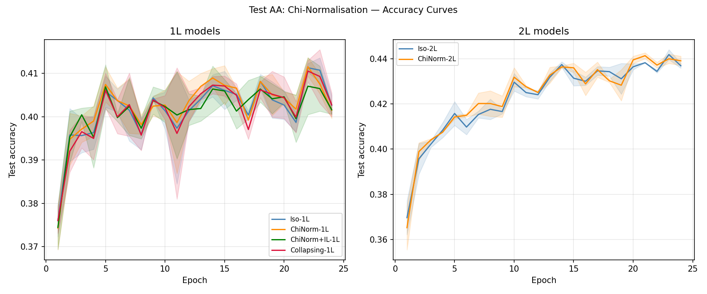
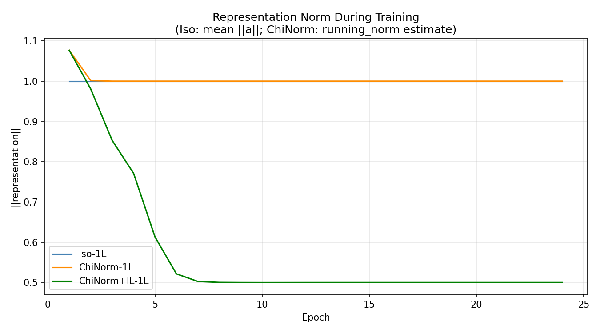

# Test AA -- Chi-Normalisation

## Setup
- Model: IsotropicMLP [3072->24->10], trained 24 epochs
- Depths: 1L and 2L; Seeds: [42, 123]; lr=0.08, batch=128
- Chi-norm momentum: 0.01
- Device: cuda

## Question
Does Chi-normalisation (running mean of ||h||) improve accuracy?
Does Intrinsic Length become more effective with controlled norms?

## Results

| Model | Mean Acc | Std | Final repr norm |
|---|---|---|---|
| Iso-1L | 0.4026 | 0.0023 | 1.0000 |
| ChiNorm-1L | 0.4015 | 0.0019 | 1.0000 |
| ChiNorm+IL-1L | 0.4016 | 0.0010 | 0.5000 |
| Collapsing-1L | 0.4028 | 0.0028 | 1.0000 |
| Iso-2L | 0.4369 | 0.0010 | 1.0000 |
| ChiNorm-2L | 0.4390 | 0.0020 | 1.0000 |

## Intrinsic Length Analysis
- Iso-1L (no norm):      0.4026
- ChiNorm-1L:            0.4015  (delta vs Iso: -0.0011)
- ChiNorm+IL-1L:         0.4016  (delta vs ChiNorm: +0.0001)
- ChiNorm-2L vs Iso-2L:  +0.0022

## Verdict
Chi-norm does not improve accuracy vs plain Iso (0.4015 vs 0.4026, delta=-0.0011).
Intrinsic length remains negligible with Chi-norm (delta=+0.0001).

