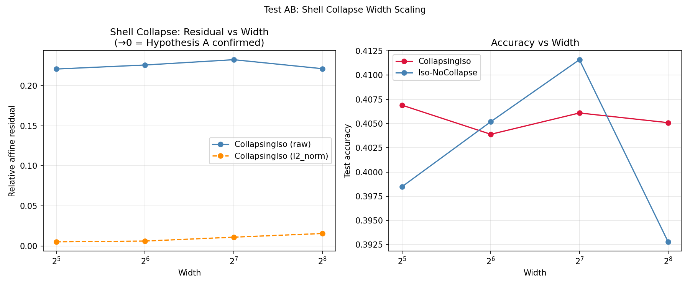

# Test AB -- Shell Collapse Width Scaling

## Setup
- Model: CollapsingIso [3072->width->10] (IsotropicTanh + HypersphericalNorm)
- Widths: [32, 64, 128, 256]
- Epochs: 24, lr=0.08, batch=128, seed=42
- Affine residual measured on full 10K test set (overdetermined, unlike Test F)
- Device: cuda

## Question
Is the non-zero affine residual from Tests O/T a finite-size effect
(vanishes as width->inf) or a genuine theoretical gap?

Hypothesis A (finite-size): residual decays to 0 as width increases.
Hypothesis B (genuine gap): residual stays constant or grows.

## Results

| Width | Model | Input | Acc | Abs Residual | Rel Residual |
|---|---|---|---|---|---|
| 32 | CollapsingIso | raw | 0.4069 | 0.305039 | 0.2210 |
| 32 | CollapsingIso | l2_norm | 0.4069 | 0.016452 | 0.0051 |
| 64 | CollapsingIso | raw | 0.4039 | 0.290704 | 0.2260 |
| 64 | CollapsingIso | l2_norm | 0.4039 | 0.018682 | 0.0060 |
| 128 | CollapsingIso | raw | 0.4061 | 0.298341 | 0.2327 |
| 128 | CollapsingIso | l2_norm | 0.4061 | 0.042440 | 0.0109 |
| 256 | CollapsingIso | raw | 0.4051 | 0.296003 | 0.2214 |
| 256 | CollapsingIso | l2_norm | 0.4051 | 0.066238 | 0.0155 |

## Verdict
INCONCLUSIVE: residual flat with width (slope=0.000002)

## Connection to Tests O and T
- Test O (width=32, raw inputs): CollapsingIso-1L rel_resid = 0.245
- Test T (width=32, L2 inputs):  CollapsingIso-1L rel_resid = 0.308
- Test T found L2 inputs INCREASED residual -- opposite of paper's prediction.
- This test checks whether the residual scales with width to resolve the discrepancy.

