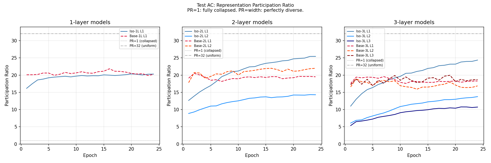
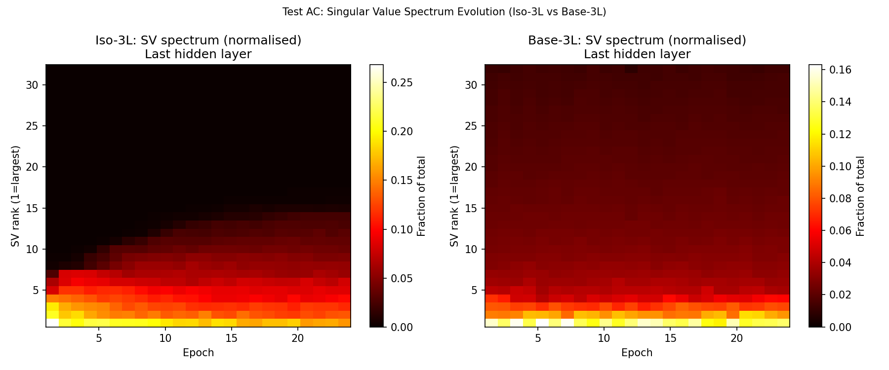
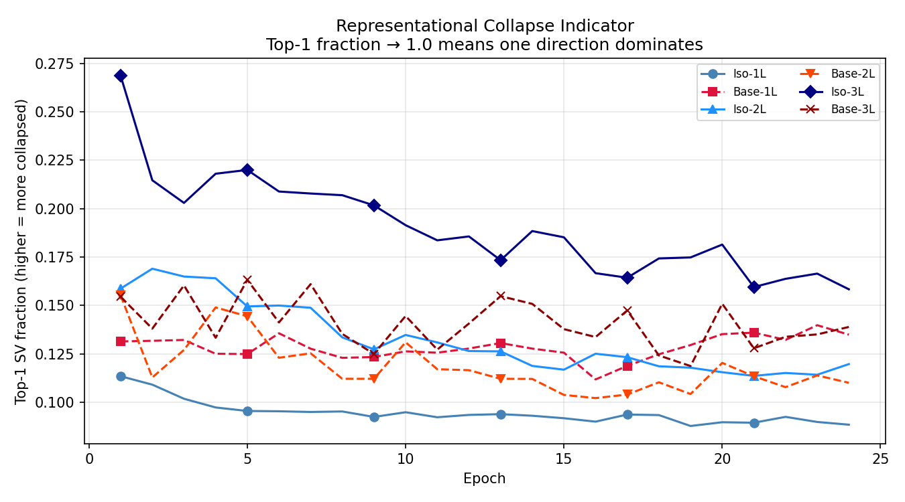

# Test AC -- Representation Spectrum Mechanism

## Setup
- Models: Iso/Base at 1L, 2L, 3L depth
- Width: 32, Epochs: 24, Seed: 42
- Probe: 1024 fixed samples, evaluated at every epoch
- Metric: Participation Ratio of hidden representation SVD
  PR = (sum sv)^2 / sum(sv^2), ranges 1 (collapsed) to width (uniform)
- Device: cuda

## Question
Why does standard tanh fail at depth while isotropic succeeds?
Test R was inconclusive. This test tracks the full SV spectrum.

## Final-Epoch Statistics (last hidden layer)

| Model | Acc | PR | top-1 frac | top-3 frac | nuc/op | repr norm |
|---|---|---|---|---|---|---|
| Iso-1L | 0.4006 | 20.30 | 0.088 | 0.243 | 11.31 | 1.0000 |
| Base-1L | 0.2701 | 20.22 | 0.135 | 0.282 | 7.41 | 5.6561 |
| Iso-2L | 0.4397 | 14.31 | 0.120 | 0.307 | 8.35 | 1.0000 |
| Base-2L | 0.2638 | 21.98 | 0.110 | 0.271 | 9.09 | 5.6155 |
| Iso-3L | 0.4445 | 10.73 | 0.158 | 0.405 | 6.32 | 1.0000 |
| Base-3L | 0.2302 | 18.70 | 0.139 | 0.312 | 7.20 | 5.6287 |

## PR Trajectory Analysis
Iso-3L PR: 5.35 → 10.73 (change=+5.37)
Base-3L PR: 17.22 → 18.70 (change=+1.48)

## Verdict
Partial collapse: Base PR=18.7 vs Iso PR=10.7.

## Connection to Prior Tests
- Test R: measured effective rank (hook-based, NaN for Iso), inconclusive
- Test X: rank regularisation had 0% effect on Base accuracy
  --> if collapse is the mechanism, Test X failing means collapse happens
      in weight space, not representation space (or needs different intervention)

