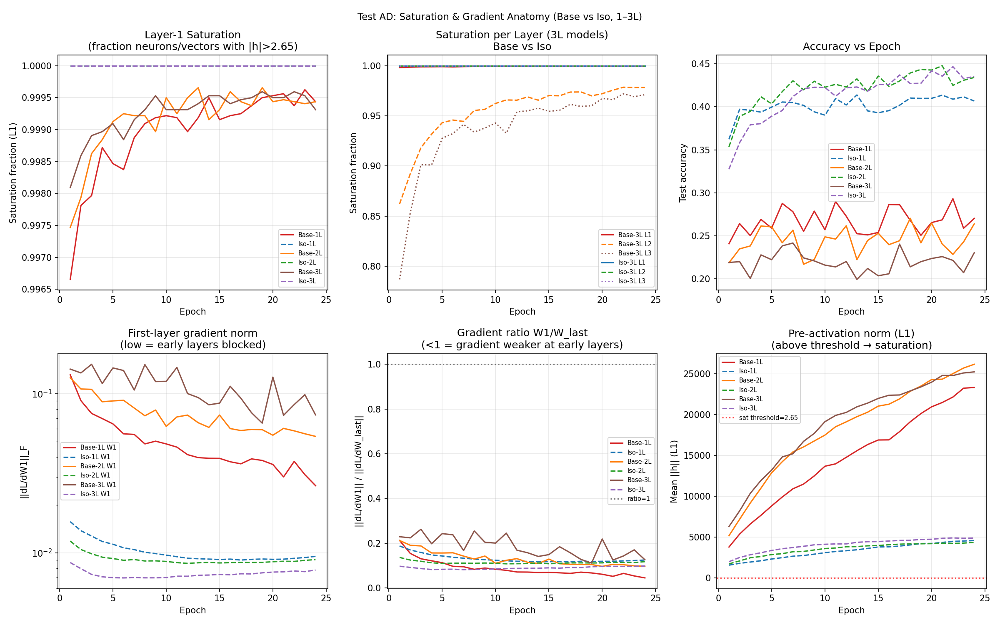

# Test AD -- Saturation & Gradient Anatomy

## Setup
- Models: Base/Iso at 1L, 2L, 3L depth
- Width: 32, Epochs: 24, Seed: 42, lr=0.08
- Saturation threshold: 2.646 (tanh saturation at 99%)
- Probe: 1024 fixed samples; gradients averaged over all training batches
- Device: cuda

## Hypothesis
Base depth failure = per-neuron tanh saturation compounding with depth.
Prediction: Base saturation fraction increases with depth; Iso stays low.
Also: W1 gradient weaker than W_last in deep Base (gradients blocked by saturated neurons).

## Results

| Model | Acc | Sat fraction (L1/L2/L3) | grad W1 | grad W_last | W1/W_last ratio |
|---|---|---|---|---|---|
| Base-1L | 0.2701 | 0.9994 | 0.026443 | 0.594013 | 0.0445 |
| Base-2L | 0.2638 | 0.9994 / 0.9609 | 0.053877 | 0.558254 | 0.0965 |
| Base-3L | 0.2302 | 0.9993 / 0.9783 / 0.9712 | 0.073504 | 0.584859 | 0.1257 |
| Iso-1L | 0.4068 | 1.0000 | 0.009508 | 0.076354 | 0.1245 |
| Iso-2L | 0.4342 | 1.0000 / 1.0000 | 0.009078 | 0.077510 | 0.1171 |
| Iso-3L | 0.4354 | 1.0000 / 1.0000 / 1.0000 | 0.007809 | 0.079929 | 0.0977 |

## Verdict
DOES NOT SUPPORT saturation hypothesis: Base-3L sat=0.9829 not clearly higher than Iso-3L=1.0000

Base-3L mean saturation: 0.9829
Iso-3L  mean saturation: 1.0000
Base-1L L1  saturation:  0.9994
Iso-1L  L1  saturation:  1.0000

## Gradient ratio analysis
(W1/W_last < 1 means first layer receives weaker gradient signal)
- Base-1L: W1/W_last = 0.0865
- Base-2L: W1/W_last = 0.1295
- Base-3L: W1/W_last = 0.1849
- Iso-1L: W1/W_last = 0.1300
- Iso-2L: W1/W_last = 0.1130
- Iso-3L: W1/W_last = 0.0892

