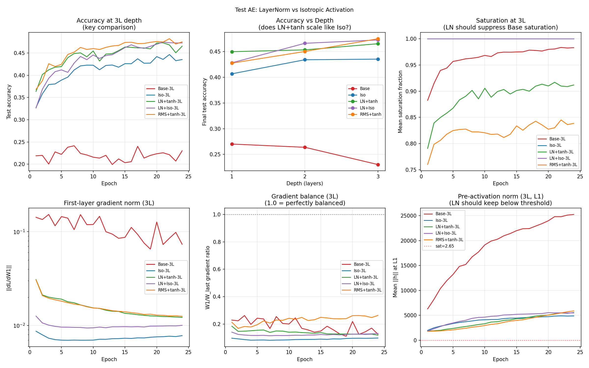

# Test AE -- LayerNorm vs Isotropic Activation

## Setup
- Models: Base, Iso, LN+tanh, LN+Iso, RMS+tanh at 1L/2L/3L depth
- Width: 32, Epochs: 24, Seed: 42, lr=0.08
- Device: cuda

## Question
Does LayerNorm + standard tanh match isotropic tanh at depth?
Is Jacobian preservation the real principle, or is isotropy specifically necessary?

## Results

| Model | Acc | Mean sat | Grad W1/W_last |
|---|---|---|---|
| Base-1L | 0.2701 | 0.9994 | 0.0869 |
| Base-2L | 0.2638 | 0.9802 | 0.1297 |
| Base-3L | 0.2302 | 0.9829 | 0.1849 |
| Iso-1L | 0.4068 | 1.0000 | 0.1304 |
| Iso-2L | 0.4342 | 1.0000 | 0.1131 |
| Iso-3L | 0.4354 | 1.0000 | 0.0891 |
| LN+tanh-1L | 0.4499 | 0.9974 | 0.0732 |
| LN+tanh-2L | 0.4534 | 0.9298 | 0.1013 |
| LN+tanh-3L | 0.4654 | 0.9118 | 0.1406 |
| LN+Iso-1L | 0.4282 | 1.0000 | 0.1446 |
| LN+Iso-2L | 0.4662 | 1.0000 | 0.1360 |
| LN+Iso-3L | 0.4727 | 1.0000 | 0.1217 |
| RMS+tanh-1L | 0.4276 | 0.9966 | 0.1298 |
| RMS+tanh-2L | 0.4503 | 0.8681 | 0.1146 |
| RMS+tanh-3L | 0.4751 | 0.8385 | 0.2216 |

## Depth Scaling Summary

| Model | 1L | 2L | 3L | 2L-1L | 3L-1L |
|---|---|---|---|---|---|
| Base | 0.2701 | 0.2638 | 0.2302 | -0.0063 | -0.0399 |
| Iso | 0.4068 | 0.4342 | 0.4354 | +0.0274 | +0.0286 |
| LN+tanh | 0.4499 | 0.4534 | 0.4654 | +0.0035 | +0.0155 |
| LN+Iso | 0.4282 | 0.4662 | 0.4727 | +0.0380 | +0.0445 |
| RMS+tanh | 0.4276 | 0.4503 | 0.4751 | +0.0227 | +0.0475 |

## Verdict
OUTCOME 1: LN+tanh closes 115% of Iso-Base gap at 3L (0.4654 vs Iso 0.4354 vs Base 0.2302). Jacobian preservation is the principle; iso is one of several solutions.

LN gap closure at 3L: 114.6%
- Iso-3L:      0.4354
- LN+tanh-3L:  0.4654
- Base-3L:     0.2302

