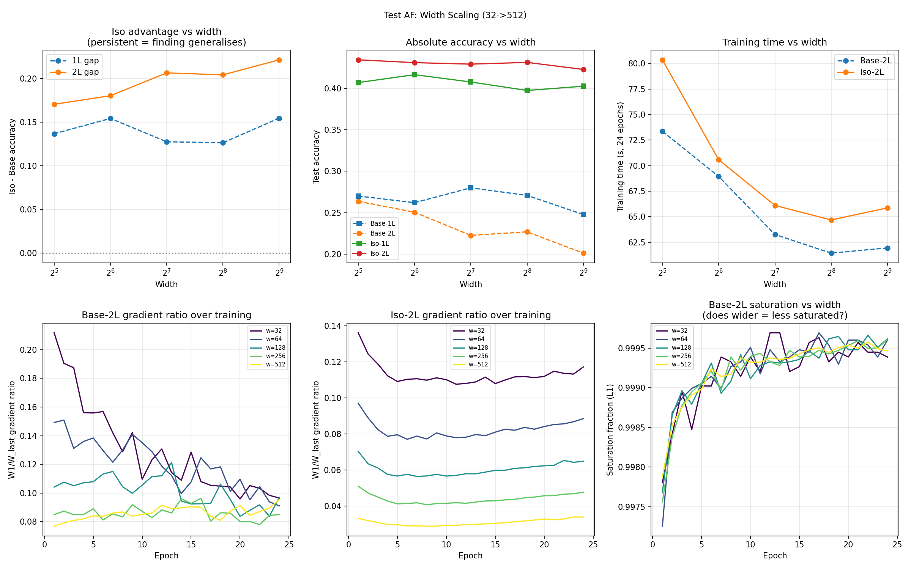

# Test AF -- Width Scaling (32 -> 512)

## Setup
- Models: Base and Iso at 1L and 2L depth
- Widths: [32, 64, 128, 256, 512]
- Epochs: 24, lr=0.08, batch=128, seed=42
- Device: cuda

## Question
Do the key findings from width=32 persist as width scales to 512?
Specifically: does the Iso > Base advantage hold at larger scale?

## Results

| Width | Base-1L | Iso-1L | Gap-1L | Base-2L | Iso-2L | Gap-2L | Time(2L) |
|---|---|---|---|---|---|---|---|
| 32 | 0.2701 | 0.4068 | +0.1367 | 0.2638 | 0.4342 | +0.1704 | 80s |
| 64 | 0.2621 | 0.4163 | +0.1542 | 0.2506 | 0.4308 | +0.1802 | 71s |
| 128 | 0.2800 | 0.4075 | +0.1275 | 0.2227 | 0.4290 | +0.2063 | 66s |
| 256 | 0.2709 | 0.3973 | +0.1264 | 0.2270 | 0.4311 | +0.2041 | 65s |
| 512 | 0.2479 | 0.4024 | +0.1545 | 0.2013 | 0.4226 | +0.2213 | 66s |

## Gap trend at 2L: GROWING
Min gap: +0.1704 (w=32)
Max gap: +0.2213 (w=512)

## Gradient anatomy (Base-2L epoch-mean W1/W_last ratio)
- w=32: 0.1297
- w=64: 0.1203
- w=128: 0.1013
- w=256: 0.0859
- w=512: 0.0859

## Gradient anatomy (Iso-2L epoch-mean W1/W_last ratio)
- w=32: 0.1131
- w=64: 0.0823
- w=128: 0.0604
- w=256: 0.0440
- w=512: 0.0309

