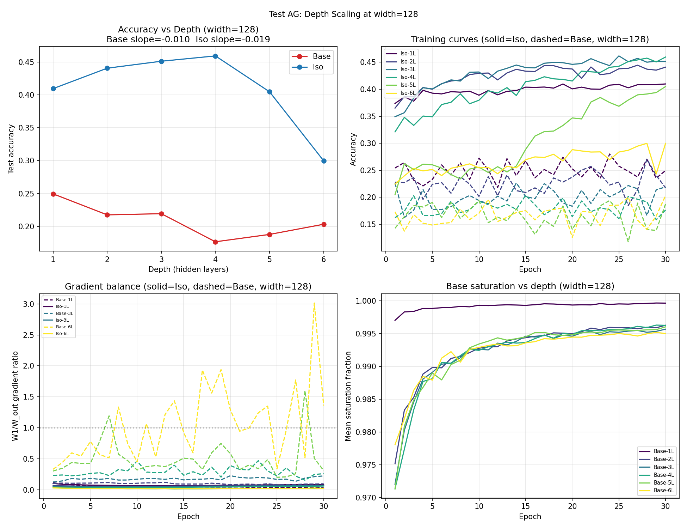

# Test AG -- Depth Scaling at width=128

## Setup
- Models: Base and Iso MLP
- Width: 128 (larger than prior tests at width=32)
- Depths: [1, 2, 3, 4, 5, 6]
- Epochs: 30, lr=0.08, seed=42
- Device: cuda

## Question
Does Iso depth stability hold at larger width?
At what depth does Iso plateau?

## Results

| Depth | Base | Iso | Gap | Base Delta from 1L | Iso Delta from 1L |
|---|---|---|---|---|---|
| 1 | 0.2494 | 0.4097 | +0.1603 | +0.0000 | +0.0000 |
| 2 | 0.2174 | 0.4408 | +0.2234 | -0.0320 | +0.0311 |
| 3 | 0.2192 | 0.4514 | +0.2322 | -0.0302 | +0.0417 |
| 4 | 0.1764 | 0.4595 | +0.2831 | -0.0730 | +0.0498 |
| 5 | 0.1876 | 0.4049 | +0.2173 | -0.0618 | -0.0048 |
| 6 | 0.2031 | 0.2998 | +0.0967 | -0.0463 | -0.1099 |

## Per-layer slope (linear fit)
- Base: -0.0104 per layer
- Iso:  -0.0185 per layer

(For reference, at width=32: Base=-0.061/layer, Iso=+0.034/layer)

