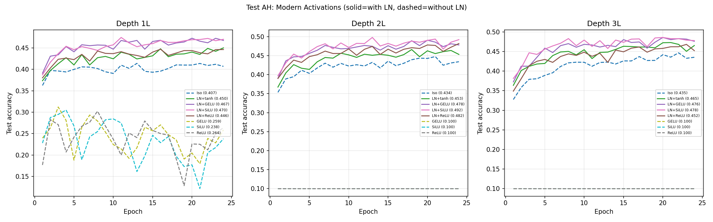

# Test AH -- Modern Activations with LayerNorm

## Setup
- Width: 32, Epochs: 24, Seed: 42, lr=0.08
- Device: cuda

## Question
Does the LN+tanh advantage over Iso generalise to modern activations?
LN+GELU = standard Transformer FFN. LN+SiLU = LLaMA FFN.

## Results

| Model | LN? | 1L | 2L | 3L | 3L-1L |
|---|---|---|---|---|---|
| Iso | No | 0.4068 | 0.4342 | 0.4354 | +0.0286 |
| LN+tanh | Yes | 0.4499 | 0.4534 | 0.4654 | +0.0155 |
| LN+GELU | Yes | 0.4672 | 0.4783 | 0.4762 | +0.0090 |
| LN+SiLU | Yes | 0.4699 | 0.4923 | 0.4780 | +0.0081 |
| LN+ReLU | Yes | 0.4460 | 0.4820 | 0.4523 | +0.0063 |
| GELU | No | 0.2586 | 0.1000 | 0.1000 | -0.1586 |
| SiLU | No | 0.2380 | 0.1000 | 0.1000 | -0.1380 |
| ReLU | No | 0.2641 | 0.1000 | 0.1000 | -0.1641 |

Iso-3L reference: 0.4354

## LN models beating Iso at 3L: 4/4
- LN+SiLU: 0.4780 (+0.0426 over Iso)
- LN+GELU: 0.4762 (+0.0408 over Iso)
- LN+tanh: 0.4654 (+0.0300 over Iso)
- LN+ReLU: 0.4523 (+0.0169 over Iso)

## Verdict
All LN models beat Iso at 3L -- normalisation is the key principle, activation function is secondary.

