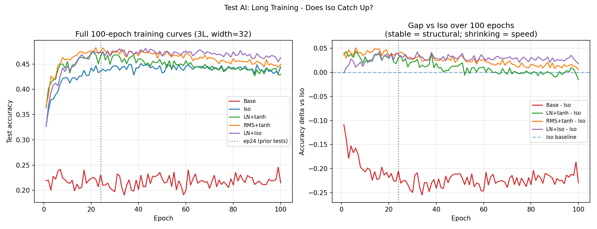

# Test AI -- Long Training (100 epochs)

## Setup
- Width: 32, Depth: 3, Epochs: 100, lr=0.08, seed=42
- Device: cuda

## Question
Does Iso catch up to LN+tanh with more training (convergence speed) or does
the gap persist (structural advantage of normalisation)?

## Results

| Model | ep24 | ep50 | ep100 | Peak | Peak epoch |
|---|---|---|---|---|---|
| Base | 0.2302 | 0.2222 | 0.2147 | 0.2457 | ep99 |
| Iso | 0.4354 | 0.4323 | 0.4443 | 0.4510 | ep41 |
| LN+tanh | 0.4654 | 0.4488 | 0.4289 | 0.4746 | ep25 |
| RMS+tanh | 0.4751 | 0.4664 | 0.4493 | 0.4822 | ep22 |
| LN+Iso | 0.4727 | 0.4656 | 0.4625 | 0.4811 | ep43 |

## Verdict
Gap SHRINKS from ep24 (+0.0300) to ep100 (-0.0154): Iso catching up

LN+tanh vs Iso gap at ep24: +0.0300
LN+tanh vs Iso gap at ep100: -0.0154

