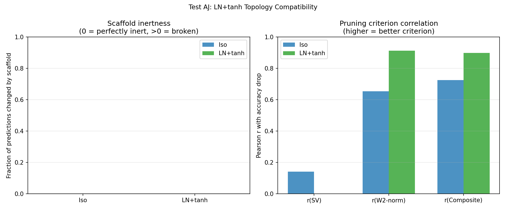

# Test AJ -- LN+tanh Topology Compatibility

## Setup
- Width: 32, Epochs: 24, seed=42
- Device: cuda

## Question
Does LN+tanh support exact dynamic topology (pruning/growing) like Iso?
If not, the paper's contribution survives as topology-specific even if
LN+tanh beats Iso on accuracy.

## Test 1: Scaffold Neuron Inertness

| Model | Max output diff | Mean output diff | Pred match | Verdict |
|---|---|---|---|---|
| Iso     | 0.000003 | 0.000000 | 1.0000 | INERT |
| LN+tanh | 0.086253 | 0.017490 | 1.0000 | NOT INERT |

Iso: inert. LN+tanh: NOT inert -- LN normalises across all neurons, so adding a zero scaffold changes existing neuron outputs.

## Test 2: Pruning Criterion Correlation

| Model | r(SV) | r(W2-norm) | r(Composite) | Acc |
|---|---|---|---|---|
| Iso     | 0.1406 | 0.6538 | 0.7245 | 0.4163 |
| LN+tanh | -0.1126 | 0.9136 | 0.8993 | 0.4431 |

SV criterion weaker for LN+tanh than Iso.

## Overall Verdict
LN+tanh CANNOT support exact dynamic topology: scaffold neurons are not inert due to LayerNorm normalising across all neurons. The paper's topology claims survive as a unique advantage of isotropic activation.

