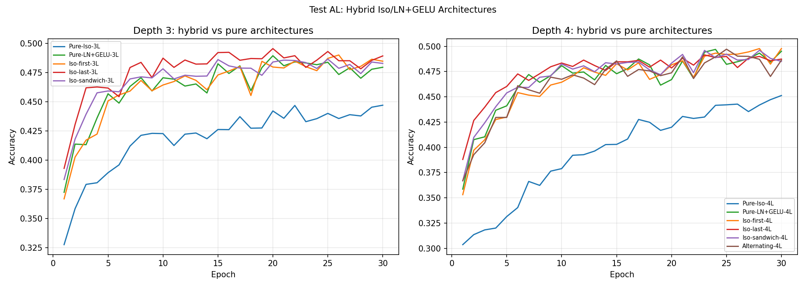

# Test AL -- Hybrid Architectures

## Setup
- Width: 32, Epochs: 30, lr=0.08, seed=42
- Device: cpu

## Question
Does inserting Iso layers at topology boundaries preserve accuracy
while enabling dynamic topology at those layers?

## Results

| Model | Layers | Iso count | Final | Peak |
|---|---|---|---|---|
| Pure-Iso-3L | Iso,Iso,Iso | 3/3 | 0.4469 | 0.4469 |
| Pure-LN+GELU-3L | LNG,LNG,LNG | 0/3 | 0.4794 | 0.4893 |
| Iso-first-3L | Iso,LNG,LNG | 1/3 | 0.4846 | 0.4899 |
| Iso-last-3L | LNG,LNG,Iso | 1/3 | 0.4891 | 0.4954 |
| Iso-sandwich-3L | Iso,LNG,Iso | 2/3 | 0.4827 | 0.4864 |
| Pure-Iso-4L | Iso,Iso,Iso,Iso | 4/4 | 0.4513 | 0.4513 |
| Pure-LN+GELU-4L | LNG,LNG,LNG,LNG | 0/4 | 0.4952 | 0.4970 |
| Iso-first-4L | Iso,LNG,LNG,LNG | 1/4 | 0.4978 | 0.4978 |
| Iso-last-4L | LNG,LNG,LNG,Iso | 1/4 | 0.4874 | 0.4915 |
| Iso-sandwich-4L | Iso,LNG,LNG,Iso | 2/4 | 0.4851 | 0.4961 |
| Alternating-4L | Iso,LNG,Iso,LNG | 2/4 | 0.4864 | 0.4972 |

## 3L references
- Pure-Iso-3L: 0.4469
- Pure-LN+GELU-3L: 0.4794

## 4L references
- Pure-Iso-4L: 0.4513
- Pure-LN+GELU-4L: 0.4952

