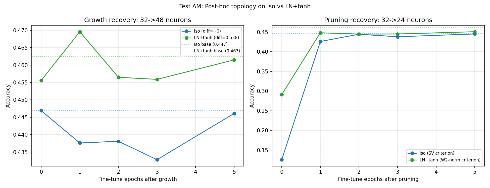

# Test AM -- Post-hoc Topology: Iso vs LN+tanh

## Setup
- Iso-3L and LN+tanh-3L, width=32, trained 30 epochs
- Growth: 32->48  |  Pruning: 32->24
- Device: cpu

## Base accuracies
- Iso: 0.4469
- LN+tanh: 0.4626

## Growth (32->48)
Output diff after scaffold insertion: Iso=0.000243  LN+tanh=0.538207

| Fine-tune epochs | Iso | Iso delta | LN+tanh | LN+tanh delta |
|---|---|---|---|---|
| 0 | 0.4469 | +0.0000 | 0.4556 | -0.0070 |
| 1 | 0.4376 | -0.0093 | 0.4696 | +0.0070 |
| 2 | 0.4381 | -0.0088 | 0.4565 | -0.0061 |
| 3 | 0.4328 | -0.0141 | 0.4559 | -0.0067 |
| 5 | 0.4461 | -0.0008 | 0.4615 | -0.0011 |

## Pruning (32->24)
Criterion: Iso=SV (row norm proxy), LN+tanh=W2-norm

| Fine-tune epochs | Iso | Iso delta | LN+tanh | LN+tanh delta |
|---|---|---|---|---|
| 0 | 0.1255 | -0.3214 | 0.2911 | -0.1715 |
| 1 | 0.4260 | -0.0209 | 0.4482 | -0.0144 |
| 2 | 0.4445 | -0.0024 | 0.4449 | -0.0177 |
| 3 | 0.4381 | -0.0088 | 0.4451 | -0.0175 |
| 5 | 0.4452 | -0.0017 | 0.4509 | -0.0117 |

