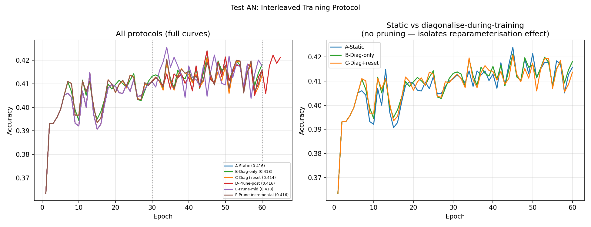

# Test AN -- Interleaved Training Protocol

## Setup
- Core IsotropicMLP (1L), width=32, 60 epochs base, lr=0.08, seed=42
- Device: cpu

## Question
Does running partial_diagonalise during training (as the paper intends) change
outcomes vs static training then post-hoc topology operations?

## Results

| Protocol | ep60 acc | Peak | vs Static |
|---|---|---|---|
| A-Static | 0.4157 | 0.4240 | +0.0000 |
| B-Diag-only | 0.4181 | 0.4212 | +0.0024 |
| C-Diag+reset | 0.4137 | 0.4208 | -0.0020 |
| D-Prune-post | 0.4157 | 0.4240 | +0.0000 |
| E-Prune-mid | 0.4176 | 0.4255 | +0.0019 |
| F-Prune-incremental | 0.4160 | 0.4205 | +0.0003 |

## Key comparisons
- A vs B: effect of diagonalising during training (stale Adam momentum)
- B vs C: whether resetting Adam after diagonalise recovers performance
- D vs E: whether pruning mid-training vs post-training matters

