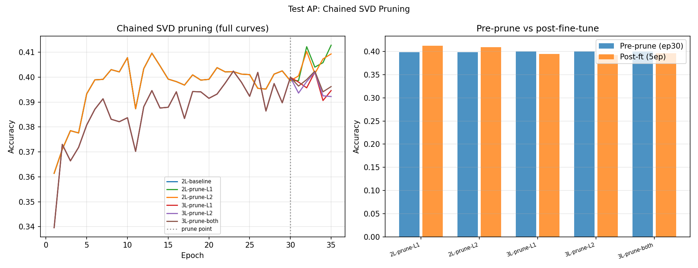

# Test AP -- Chained SVD Pruning

## Setup
- IsoMLP (2L or 3L), width=32, 30 epochs training + 5ep fine-tune
- Pruning: SVD-diagonalise boundary then drop bottom 8 singular values
- Device: cpu

## Question
Does proper chained SVD pruning (per-boundary SVD, drop by singular value)
preserve accuracy better than AM's row-norm proxy?

## Results

| Condition | Pre-prune (ep30) | Post-ft (ep35) | Delta |
|---|---|---|---|
| 2L-baseline | 0.3985 | 0.3985 | +0.0000 |
| 2L-prune-L1 | 0.3985 | 0.4128 | +0.0143 |
| 2L-prune-L2 | 0.3985 | 0.4093 | +0.0108 |
| 3L-prune-L1 | 0.3999 | 0.3946 | -0.0053 |
| 3L-prune-L2 | 0.3999 | 0.3922 | -0.0077 |
| 3L-prune-both | 0.3999 | 0.3962 | -0.0037 |

## Method
For each boundary idx:
  1. SVD-diagonalise layer[idx]: W = U S Vt -> W = S Vt, W_next = W_next @ U
  2. Keep top-24 rows (largest singular values)
  3. Drop corresponding input columns in next layer
  4. Re-initialise Adam from scratch (fresh parameter references)

