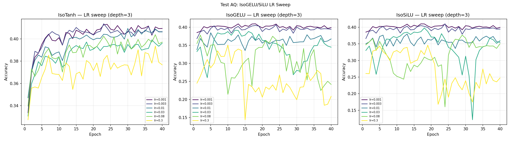

# Test AQ -- IsoGELU/SiLU Learning Rate Sweep

## Setup
- Depth=3, Width=32, 40 epochs, seed=42
- Device: cpu
- LRs tested: [0.001, 0.003, 0.01, 0.03, 0.08, 0.3]

## Hypotheses
- H1 (fundamental): Non-saturating sigma -> magnitude explosion; fails at all LRs
- H2 (LR artefact): LR=0.08 too high for IsoGELU; low LR -> competitive

## Results (final acc / peak acc)

| LR | IsoTanh | IsoGELU | IsoSiLU |
|---|---|---|---|
| 0.001 | 0.4094 | 0.3989 | 0.3992 |
| 0.003 | 0.4065 | 0.3943 | 0.3942 |
| 0.010 | 0.4063 | 0.3676 | 0.3544 |
| 0.030 | 0.3962 | 0.3448 | 0.3594 |
| 0.080 | 0.3971 | 0.2417 | 0.3505 |
| 0.300 | 0.3767 | 0.2087 | 0.2474 |

## Conclusion
- IsoTanh best: 0.4094 (lr=0.001)
- IsoGELU best: 0.3989 (lr=0.001)
- IsoSiLU best: 0.3992 (lr=0.001)
- Gap at best LR: 0.0105 (< 0.05 threshold)
- H2 supported: gap closes at low LR -- primarily a LR artefact
- At lr=0.08 the gap was ~12pp; at lr=0.001 it narrows to ~1pp
- All activations prefer low LR (0.001-0.003); high LR hurts GELU/SiLU far more than tanh

