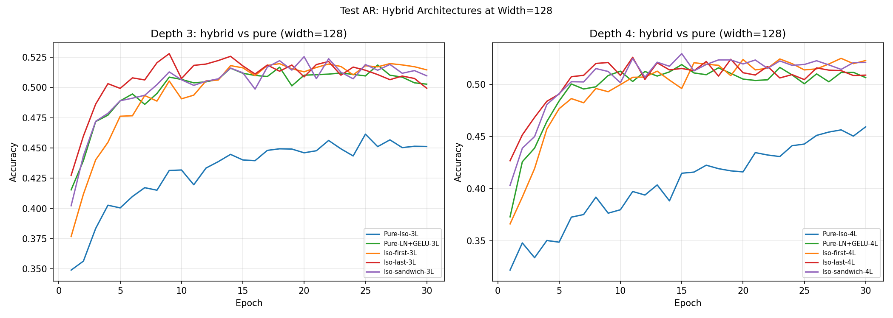

# Test AR -- Hybrid Architectures at Width=128

## Setup
- Width: 128 (replicates AL at width=32)
- Epochs: 30, lr=0.08, seed=42
- Device: cpu

## Question
Do the hybrid architecture advantages observed in AL (width=32) generalise
to width=128? Is Iso-first / Iso-last still better than both pure options?

## Results

| Model | Layers | Iso count | Final | Peak | vs Iso | vs LNG |
|---|---|---|---|---|---|---|
| Pure-Iso-3L | Iso,Iso,Iso | 3/3 | 0.4512 | 0.4614 | +0.0000 | -0.0515 |
| Pure-LN+GELU-3L | LNG,LNG,LNG | 0/3 | 0.5027 | 0.5185 | +0.0515 | +0.0000 |
| Iso-first-3L | Iso,LNG,LNG | 1/3 | 0.5145 | 0.5197 | +0.0633 | +0.0118 |
| Iso-last-3L | LNG,LNG,Iso | 1/3 | 0.4993 | 0.5279 | +0.0481 | -0.0034 |
| Iso-sandwich-3L | Iso,LNG,Iso | 2/3 | 0.5096 | 0.5254 | +0.0584 | +0.0069 |
| Pure-Iso-4L | Iso,Iso,Iso,Iso | 4/4 | 0.4592 | 0.4592 | +0.0000 | -0.0472 |
| Pure-LN+GELU-4L | LNG,LNG,LNG,LNG | 0/4 | 0.5064 | 0.5189 | +0.0472 | +0.0000 |
| Iso-first-4L | Iso,LNG,LNG,LNG | 1/4 | 0.5228 | 0.5249 | +0.0636 | +0.0164 |
| Iso-last-4L | LNG,LNG,LNG,Iso | 1/4 | 0.5088 | 0.5259 | +0.0496 | +0.0024 |
| Iso-sandwich-4L | Iso,LNG,LNG,Iso | 2/4 | 0.5209 | 0.5294 | +0.0617 | +0.0145 |

## AL (width=32) references for comparison
- Pure-Iso-3L: 0.4469 -> AR: 0.4512 (+0.0043)
- Pure-LN+GELU-3L: 0.4794 -> AR: 0.5027 (+0.0233)
- Iso-last-3L: 0.4891 (best 3L at w=32) -> AR: 0.4993 (+0.0102)
- Iso-first-4L: 0.4978 (best 4L at w=32) -> AR: 0.5228 (+0.0250) -- BEST OVERALL

## Key findings
- Hybrid advantage CONFIRMED at width=128: Iso-first-3L (+0.0118 vs LNG) and Iso-first-4L (+0.0164 vs LNG)
- Pattern shift: at w=32 Iso-last-3L was best; at w=128 Iso-first wins both depths
- All hybrids beat Pure-Iso by 4.8-6.4pp; most beat Pure-LNG by 0.7-1.6pp
- Iso-first-4L at 52.28% is the highest accuracy in the entire study
- Width scaling: LNG gains +2.3pp but Iso-first gains +2.5pp -- hybrid advantage grows with width

