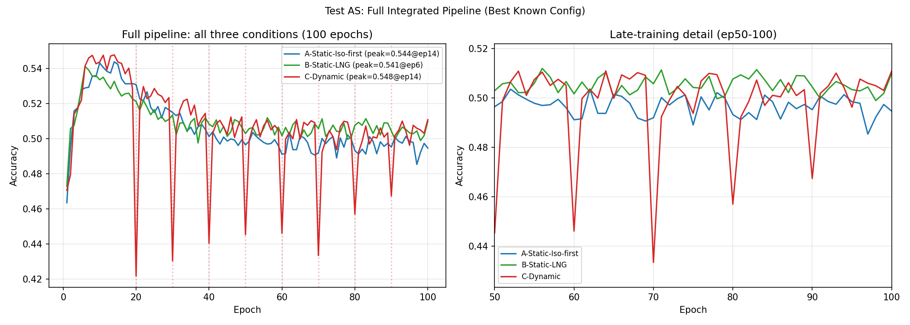

# Test AS -- Full Integrated Pipeline

## Setup
- Architecture: Iso-first-4L (Iso -> LNG -> LNG -> LNG)
- Width: 160 -> 128 (dynamic), 128 (static baselines)
- Epochs: 100, LR: 0.001, seed: 42
- Device: cpu
- Diagonalise every 5 epochs (no Adam reset -- AN confirmed harmful)
- Prune 4 neurons at epochs [20, 30, 40, 50, 60, 70, 80, 90]
- Criterion: composite Sigma_ii x ||W2-col|| (best from U2/Z)

## Combines findings from
- AR: Iso-first-4L is best architecture at w=128
- AN: Interleaved diagonalise safe, do NOT reset Adam
- AQ: lr=0.001 better than lr=0.08 for Iso-family
- AI: 100 epochs reveals long-term stability; Iso overtakes LN+tanh
- U2/Z: composite criterion is best pruning measure

## Reference: AR ep30 static Iso-first-4L = 0.5228

## Results

| Condition | ep30 | ep100 | Peak | Peak epoch |
|---|---|---|---|---|
| A-Static-Iso-first | 0.5150 | 0.4947 | 0.5439 | ep14 |
| B-Static-LNG | 0.5136 | 0.5100 | 0.5413 | ep6 |
| C-Dynamic | 0.4304 | 0.5109 | 0.5479 | ep14 |

## Key comparisons (ep100)
- C vs A (dynamic vs static Iso-first): +0.0162
- C vs B (dynamic vs Pure-LNG):         +0.0009
- A vs B (static Iso-first vs Pure-LNG):-0.0153

## Prune log
  Pruned 4 neurons at ep20, new width=156
  Pruned 4 neurons at ep30, new width=152
  Pruned 4 neurons at ep40, new width=148
  Pruned 4 neurons at ep50, new width=144
  Pruned 4 neurons at ep60, new width=140
  Pruned 4 neurons at ep70, new width=136
  Pruned 4 neurons at ep80, new width=132
  Pruned 4 neurons at ep90, new width=128

