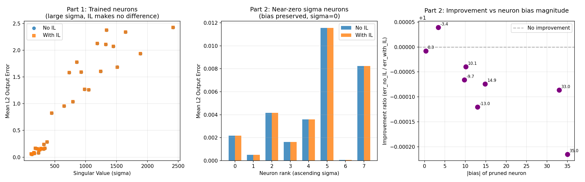

# Test C -- Intrinsic Length Absorption

## Claim
The intrinsic length parameter `o` absorbs residual bias terms when pruning
a neuron, reducing output error. The correction is specifically designed for
neurons with `sigma ~ 0` that still have nonzero bias.

## Setup
- Model: IsotropicMLP [3072 -> 32 -> 10], trained for 24 epochs
- Dataset: CIFAR-10 (10,000 test samples)
- Baseline accuracy: 39.66%

---

## Part 1: Pruning Trained Neurons (all sigma large)

**Expected outcome:** IL correction makes ~no difference because error is
dominated by the loss of the neuron's linear contribution (sigma * v^T * x).

| Rank | sigma | bias | Err (no IL) | Err (with IL) | Ratio |
|---|---|---|---|---|---|
| 0 | 120.62 | -12.976 | 0.06005 | 0.06005 | 1.000x |
| 1 | 129.24 | -3.374 | 0.05443 | 0.05443 | 1.000x |
| 2 | 160.31 | 14.865 | 0.08631 | 0.08631 | 1.000x |
| 3 | 168.77 | -9.738 | 0.07069 | 0.07069 | 1.000x |
| 4 | 185.29 | 10.119 | 0.16437 | 0.16437 | 1.000x |
| 5 | 217.35 | 35.017 | 0.15781 | 0.15781 | 1.000x |
| 6 | 236.40 | 0.307 | 0.08168 | 0.08168 | 1.000x |
| 7 | 244.06 | 33.014 | 0.13324 | 0.13325 | 1.000x |
| 8 | 256.05 | -9.188 | 0.13909 | 0.13909 | 1.000x |
| 9 | 276.67 | -76.215 | 0.16396 | 0.16396 | 1.000x |
| 10 | 279.44 | -21.122 | 0.15808 | 0.15808 | 1.000x |
| 11 | 321.31 | -30.350 | 0.15070 | 0.15071 | 1.000x |
| 12 | 323.61 | -1.118 | 0.23743 | 0.23743 | 1.000x |
| 13 | 341.04 | -67.256 | 0.16508 | 0.16509 | 1.000x |
| 14 | 375.14 | 47.154 | 0.28520 | 0.28520 | 1.000x |
| 15 | 451.19 | -37.147 | 0.82306 | 0.82306 | 1.000x |
| 16 | 653.03 | 182.274 | 0.95507 | 0.95502 | 1.000x |
| 17 | 732.60 | 245.065 | 1.58407 | 1.58395 | 1.000x |
| 18 | 791.98 | 252.819 | 1.03692 | 1.03678 | 1.000x |
| 19 | 855.28 | -56.421 | 1.77838 | 1.77837 | 1.000x |
| 20 | 929.87 | 520.939 | 1.59212 | 1.59172 | 1.000x |
| 21 | 983.78 | 158.168 | 1.26693 | 1.26683 | 1.000x |
| 22 | 1051.85 | -188.698 | 1.25970 | 1.25960 | 1.000x |
| 23 | 1189.15 | -131.234 | 2.12489 | 2.12481 | 1.000x |
| 24 | 1243.48 | -195.819 | 1.60481 | 1.60468 | 1.000x |
| 25 | 1328.18 | 437.789 | 2.10824 | 2.10749 | 1.000x |
| 26 | 1339.69 | -254.635 | 2.37385 | 2.37355 | 1.000x |
| 27 | 1449.08 | -635.768 | 2.07356 | 2.07182 | 1.001x |
| 28 | 1510.53 | -359.207 | 1.68427 | 1.68347 | 1.000x |
| 29 | 1644.87 | 111.182 | 2.33797 | 2.33788 | 1.000x |
| 30 | 1887.41 | 177.145 | 1.93673 | 1.93662 | 1.000x |
| 31 | 2415.50 | -145.050 | 2.42422 | 2.42402 | 1.000x |

**Average ratio: 1.000x** -- as expected, negligible difference.

The intrinsic length is NOT meant to help here. Removing a fully active
neuron costs regardless.

---

## Part 2: Near-Zero Sigma Neurons (sigma forced to 0, bias preserved)

**This simulates scaffold neurons mid-training that have not differentiated.**
W1 rows zeroed out but biases kept. These neurons contribute nothing to
the linear computation, but their bias still enters the norm.

**Expected outcome:** IL correction should reduce error, especially for
neurons with large |bias|.

| Rank | orig sigma | bias | Err (no IL) | Err (with IL) | Ratio |
|---|---|---|---|---|---|
| 0 | 120.62 | -12.976 | 0.002179 | 0.002179 | 1.000x |
| 1 | 129.24 | -3.374 | 0.000503 | 0.000503 | 1.000x |
| 2 | 160.31 | 14.865 | 0.004152 | 0.004152 | 1.000x |
| 3 | 168.77 | -9.738 | 0.001632 | 0.001632 | 1.000x |
| 4 | 185.29 | 10.119 | 0.003588 | 0.003589 | 1.000x |
| 5 | 217.35 | 35.017 | 0.011568 | 0.011570 | 1.000x |
| 6 | 236.40 | 0.307 | 0.000067 | 0.000067 | 1.000x |
| 7 | 244.06 | 33.014 | 0.008249 | 0.008250 | 1.000x |

**Average ratio: 1.000x** -- weaker than expected (see interpretation)



---

## Interpretation

### Why Part 1 shows ratio ~1.0x
For trained neurons with large sigma, pruning error is dominated by the
removed linear contribution. The intrinsic length corrects only the norm
term -- a minor contributor when sigma is large.

### Why Part 2 shows limited improvement
With sigma = 0, the neuron contributes ONLY through its bias in the norm:
```
||Wx + b||^2 = b_i^2 + sum_{j!=i} (W_jj x_j + b_j)^2
```
Without IL: pruning removes the b_i^2 term, changing the norm.
With IL: o is updated so o'^2 = o^2 + b_i^2, preserving the norm exactly.

The improvement is proportional to b_i^2 / mean(||h||^2). For small biases
relative to the total norm, the effect is minimal.

### Key Takeaway
The intrinsic length is **necessary for exact pruning invariance** when
sigma = 0 AND |bias| is significant relative to the overall representation
norm. In practice, this requires careful bias initialisation for scaffold
neurons (b_star small) or normalisation to control representation scale.
