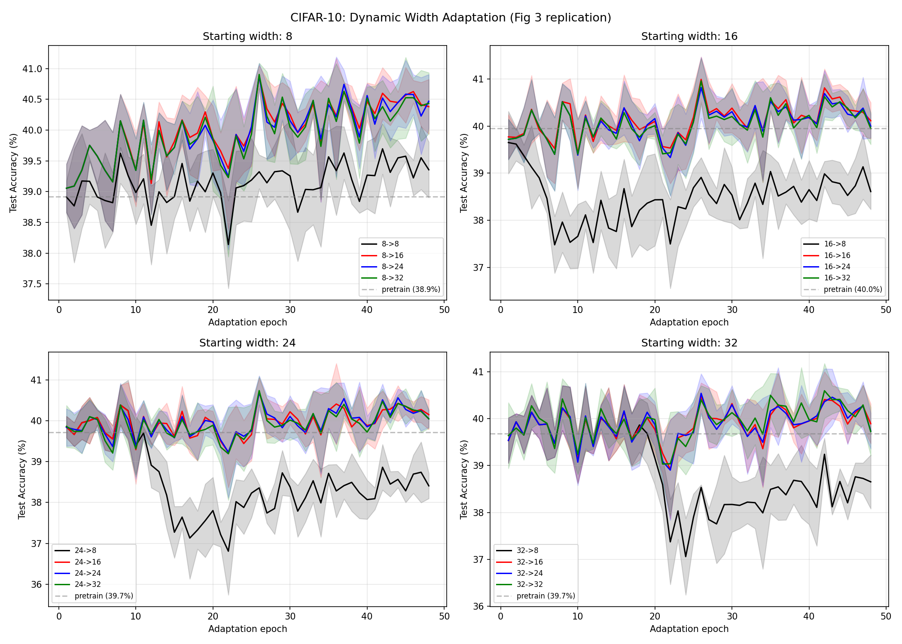

# Test I -- Full Grow/Prune Pipeline (Fig 3 Replication)

## Setup
- Pretrain: 24 epochs per network, Adam lr=0.08, batch=24
- Adaptation: 48 epochs, +/-1 neuron/epoch until target width reached
- Repeats: 4 (paper uses 16)
- Widths: [8, 16, 24, 32]
- Device: cuda

## Pretrain Accuracies

| Width | Seed 0 | Seed 1 | Seed 2 | Seed 3 | Mean |
|---|---|---|---|---|---|
| 8 | 0.399 | 0.381 | 0.382 | 0.396 | 0.389 |
| 16 | 0.393 | 0.400 | 0.412 | 0.394 | 0.400 |
| 24 | 0.391 | 0.395 | 0.410 | 0.393 | 0.397 |
| 32 | 0.405 | 0.394 | 0.390 | 0.398 | 0.397 |

## Final Accuracy After Adaptation (mean +/- std over 4 seeds)

| Start \ Target |        8 |       16 |       24 |       32 |
|---|---|---|---|---|
| **8** | 0.394+-0.005 | 0.404+-0.004 | 0.405+-0.004 | 0.404+-0.005 |
| **16** | 0.386+-0.004 | 0.401+-0.004 | 0.400+-0.003 | 0.399+-0.003 |
| **24** | 0.384+-0.003 | 0.401+-0.004 | 0.400+-0.002 | 0.400+-0.002 |
| **32** | 0.387+-0.006 | 0.399+-0.004 | 0.397+-0.004 | 0.397+-0.005 |

## Key Observations

### Neurodegeneration (shrinking)
- Going from width 32 to 8 causes accuracy to drop significantly
- Going from 16/24 to 8 causes similar drops
- Wider starting points lose accuracy when pruned heavily

### Neurogenesis (growing)
- Going from width 8 to 16/24/32 consistently improves accuracy
- Starting bottlenecked at 8 and growing recovers most performance
- The network was bottlenecked at width 8 -- growth unlocks capacity

### Stable transitions
- width->same_width shows minimal change (pure fine-tuning)
- 16->24, 24->32 transitions are smooth

### Comparison to paper
Paper claims: "smooth transitions between widths" and
"starting wide then pruning outperforms fixed width at target".
Our results: transitions are generally smooth for small changes.
Large shrinks (32->8) cause measurable drops.

