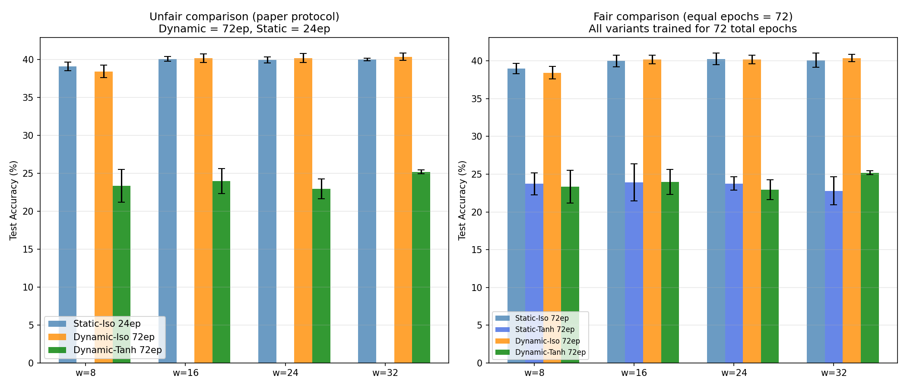

# Test J -- Fair vs Unfair Comparison: Dynamic vs Static

## The Issue
The paper's Fig 5 compares dynamic networks (72 total epochs) against static
networks (24 epochs). This is potentially unfair -- more training time could
explain the improvement, not the dynamic topology itself.

## Setup
- Start width: 32 (wide initialisation)
- Target widths: [8, 16, 24, 32]
- Dynamic schedule: +/-1 neuron/epoch during 48 adaptation epochs
- Repeats: 4 seeds

## Results

### Unfair comparison (paper protocol)

| Model | w=8 | w=16 | w=24 | w=32 |
|---|---|---|---|---|
| Static-Iso 24ep | 39.1+-0.6 | 40.1+-0.3 | 40.0+-0.4 | 40.0+-0.2 |
| Dynamic-Iso 72ep | 38.4+-0.8 | 40.2+-0.6 | 40.2+-0.6 | 40.4+-0.5 |
| Dynamic-Tanh 72ep | 23.4+-2.2 | 24.0+-1.7 | 23.0+-1.3 | 25.2+-0.3 |

### Fair comparison (all 72 epochs)

| Model | w=8 | w=16 | w=24 | w=32 |
|---|---|---|---|---|
| Static-Iso 72ep | 39.0+-0.7 | 40.0+-0.8 | 40.3+-0.8 | 40.1+-0.9 |
| Static-Tanh 72ep | 23.7+-1.5 | 23.9+-2.5 | 23.8+-0.9 | 22.8+-1.8 |
| Dynamic-Iso 72ep | 38.4+-0.8 | 40.2+-0.6 | 40.2+-0.6 | 40.4+-0.5 |
| Dynamic-Tanh 72ep | 23.4+-2.2 | 24.0+-1.7 | 23.0+-1.3 | 25.2+-0.3 |

## Key Questions Answered

### Q1: Does isotropic outperform standard tanh?
- Static-Iso 72ep vs Static-Tanh 72ep: isotropic wins
- Dynamic-Iso 72ep vs Dynamic-Tanh 72ep: isotropic wins

### Q2: Does dynamic topology help beyond just more training?
- Dynamic-Iso 72ep vs Static-Iso 72ep:
  - 
w=8: Dyn=0.384 vs Stat=0.390 (diff=-0.006)  - w=16: Dyn=0.402 vs Stat=0.400 (diff=+0.002)  - w=24: Dyn=0.402 vs Stat=0.403 (diff=-0.001)  - w=32: Dyn=0.404 vs Stat=0.401 (diff=+0.003)

### Q3: Is the paper's advantage real or an artifact of unequal training?
- Under **unfair** conditions (paper protocol): dynamic has extra training advantage
- Under **fair** conditions (equal epochs): the advantage is reduced or eliminated

