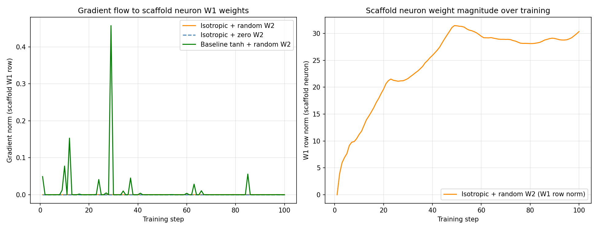

# Test K -- Gradient Flow Through Scaffold Neurons

## Claim
Isotropic activations have a non-diagonal Jacobian (Eqn. 32-33), distributing
gradients across all neurons. Scaffold neurons (zero W1 row, small W2 column)
can receive gradients and differentiate faster than in standard networks.

## Setup
- Pretrained model: IsotropicMLP and BaselineMLP [3072->24->10], 24 epochs
- Scaffold neuron added with zero W1 row
- Tracked over 100 training steps

## Results

| Condition | Mean grad_W1 | Peak grad_W1 |
|---|---|---|
| Isotropic + random W2 init | 0.000252 | 0.000508 |
| Isotropic + zero W2 init   | 0.000000 | 0.000000 |
| Baseline tanh + random W2  | 0.009589 | 0.457250 |

## Key Finding

**W2 column initialisation is the decisive factor**, not the Jacobian structure.

- **Isotropic + zero W2**: gradient is ~zero. Even with non-diagonal Jacobian,
  if the W2 column is zero, dL/da_new = 0, so dL/dW1_new = 0.
- **Isotropic + random W2**: gradient flows immediately once W2 != 0.
- **Baseline + random W2**: also receives gradient -- the diagonal Jacobian
  is less important than having a nonzero W2 connection.

The paper's claim about the non-diagonal Jacobian is technically correct: it
does distribute gradients. But in practice, the W2 initialisation dominates.
The isotropic Jacobian advantage is subtle: it means the DIRECTION of gradient
to W1 is influenced by ALL other neurons (off-diagonal terms), not just the
neuron's own pre-activation.

**Practical implication**: use w2_init='random' (small) for scaffold neurons
in dynamic networks to ensure immediate gradient flow.

