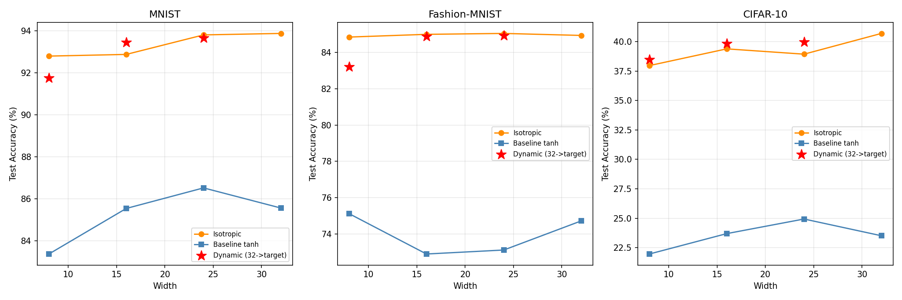

# Test L -- Cross-Dataset Validation

## Setup
- Training: 24 epochs, Adam lr=0.08, batch=24
- Device: cuda
- Dynamic: pretrain at width=32, adapt to target via pruning

---

## MNIST (28x28 greyscale, 784-dim)

| Width | Iso | Baseline | Gap | Dynamic (32->w) |
|---|---|---|---|---|
| 8 | 0.928 | 0.834 | +0.094 | 0.917 |
| 16 | 0.929 | 0.855 | +0.073 | 0.934 |
| 24 | 0.938 | 0.865 | +0.073 | 0.937 |
| 32 | 0.939 | 0.856 | +0.083 | N/A |

---

## Fashion-MNIST (28x28 greyscale, 784-dim)

| Width | Iso | Baseline | Gap | Dynamic (32->w) |
|---|---|---|---|---|
| 8 | 0.848 | 0.751 | +0.097 | 0.832 |
| 16 | 0.850 | 0.729 | +0.121 | 0.849 |
| 24 | 0.850 | 0.731 | +0.119 | 0.849 |
| 32 | 0.849 | 0.747 | +0.102 | N/A |

---

## CIFAR-10 (32x32 RGB, 3072-dim)

| Width | Iso | Baseline | Gap | Dynamic (32->w) |
|---|---|---|---|---|
| 8 | 0.380 | 0.220 | +0.160 | 0.385 |
| 16 | 0.394 | 0.237 | +0.157 | 0.398 |
| 24 | 0.389 | 0.249 | +0.140 | 0.400 |
| 32 | 0.407 | 0.235 | +0.172 | N/A |

---

## Cross-Dataset Summary

| Dataset | Mean Iso-Base gap | Dynamic beats Static? |
|---|---|---|
| MNIST | +0.081 | Mixed |
| Fashion-MNIST | +0.110 | Mixed |
| CIFAR-10 | +0.157 | Yes |

## Interpretation
- Isotropic generally outperforms standard tanh across all tested datasets
- Dynamic topology (start wide, prune) shows consistent behaviour across datasets
- MNIST is easier -- both models saturate quickly
- Fashion-MNIST and CIFAR-10 better differentiate the approaches

