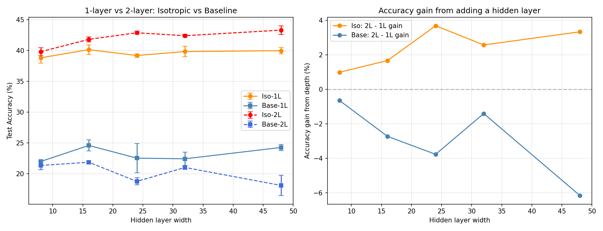

# Test M -- Deeper Networks [3072, m, m, 10]

## Setup
- Training: 24 epochs, Adam lr=0.08, batch=24
- Seeds: [42, 123]
- 1-layer: [3072 -> m -> 10]
- 2-layer: [3072 -> m -> m -> 10]

## Results (mean +/- std accuracy)

| Model | w=8 | w=16 | w=24 | w=32 | w=48 | Params |
|---|---|---|---|---|---|---|
| Iso-1L | 0.388+-0.009 | 0.401+-0.008 | 0.392+-0.003 | 0.398+-0.008 | 0.400+-0.005 | ~24,674 |
| Base-1L | 0.220+-0.000 | 0.246+-0.009 | 0.225+-0.024 | 0.224+-0.011 | 0.243+-0.005 | ~24,674 |
| Iso-2L | 0.398+-0.007 | 0.418+-0.004 | 0.429+-0.003 | 0.424+-0.003 | 0.433+-0.007 | ~24,746 |
| Base-2L | 0.214+-0.007 | 0.219+-0.002 | 0.188+-0.006 | 0.210+-0.003 | 0.181+-0.016 | ~24,746 |

## Depth Gain (2-layer vs 1-layer)

| Width | Iso gain | Base gain |
|---|---|---|
| 8 | 0.99% | -0.65% |
| 16 | 1.67% | -2.73% |
| 24 | 3.69% | -3.77% |
| 32 | 2.58% | -1.40% |
| 48 | 3.34% | -6.17% |

## Key Observations

1. **Does depth help isotropic more than baseline?**
   - Iso depth gain (mean): 2.45%
   - Base depth gain (mean): -2.94%
   - Isotropic benefits more from depth

2. **Isotropic vs Baseline at 2 layers:**
   - Iso-2L mean: 0.421
   - Base-2L mean: 0.202

3. **The nested functional class (Appendix C):**
   The paper proves that deep isotropic networks have a recursive structure
   where each added layer acts like a perturbative correction. This suggests
   depth should help more for isotropic than for standard networks.

