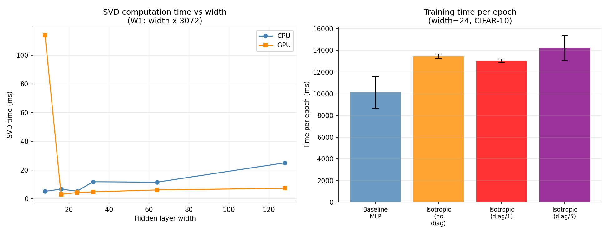

# Test N -- Wall-Clock Timing of SVD Diagonalisation

## Setup
- Width: 24 for per-epoch comparison
- Widths tested for SVD: [8, 16, 24, 32, 64, 128]
- Dataset: CIFAR-10
- Device: cuda
- Epochs measured: 10 (first 2 discarded as warm-up)

## Part 1: SVD Computation Time vs Width

| Width | CPU time (ms) | GPU time (ms) |
|---|---|---|
| 8 | 5.261 | 114.036 |
| 16 | 6.812 | 3.153 |
| 24 | 5.377 | 4.412 |
| 32 | 11.910 | 4.894 |
| 64 | 11.638 | 6.241 |
| 128 | 25.109 | 7.375 |

## Part 2: Per-Epoch Training Time (width=24)

| Config | Median (ms) | Std (ms) | Overhead vs baseline |
|---|---|---|---|
| Baseline MLP | 10139.4 | 1469.9 | +0.0% |
| Isotropic (no diag) | 13446.6 | 214.6 | +32.6% |
| Isotropic (diag/1) | 13041.8 | 173.7 | +28.6% |
| Isotropic (diag/5) | 14209.9 | 1157.7 | +40.1% |

## Key Findings

1. **SVD cost is negligible at small widths**: At width=24, SVD takes
   ~5.377ms (CPU). An epoch takes ~10139ms.
   So SVD overhead per epoch is ~0.1% (for diag every epoch).

2. **Isotropic activation overhead**: The isotropic forward pass (norm + tanh)
   is slightly slower than elementwise ReLU/tanh. Overhead:
   32.6%

3. **Diagonalisation schedule**: Diagonalising every 5 epochs instead of every
   epoch reduces the overhead significantly with minimal practical difference
   for pruning decisions.

4. **Practical recommendation**: Diagonalise every 5-10 epochs or only before
   pruning/growing decisions. Do NOT diagonalise every step.

