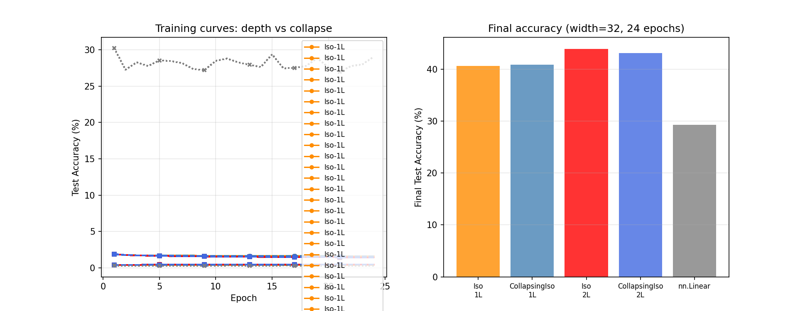

# Test O -- Two-Layer Hyperspherical Shell Collapse

## Setup
- Width: 32, Epochs: 24, lr=0.08, batch=128
- Device: CPU
- Seed: 42

## Background
Test F (1-layer) found CollapsingIso-1L (40.90%) ≈ Iso-1L (40.68%) despite being affine.
Test M found Iso-2L gains +2.5% from depth over Iso-1L.
This test checks whether the same near-equivalence holds at 2 layers.

## Results

| Model | Final Acc | Affine residual (mean) | Affine residual (max) | Relative residual |
|---|---|---|---|---|
| Iso-1L | 40.68% | N/A | N/A | N/A |
| Iso-2L | 43.97% | N/A | N/A | N/A |
| CollapsingIso-1L | 40.90% | 0.322367 | 4.803261 | 0.245111 |
| CollapsingIso-2L | 43.12% | 0.739638 | 9.269833 | 0.415577 |
| nn.Linear | 29.28% | N/A | N/A | N/A |

## Key Comparisons

| Comparison | Gap |
|---|---|
| Iso-1L vs CollapsingIso-1L | -0.22% |
| Iso-2L vs CollapsingIso-2L | +0.85% |
| Iso depth gain (2L - 1L) | +3.29% |
| Collapsing depth gain (2L - 1L) | +2.22% |

## Affine Verification
CollapsingIso-1L residual: mean=0.322367
CollapsingIso-2L residual: mean=0.739638

Both residuals should be ~0 (mathematical guarantee from Appendix C).

## Verdict
Nonlinearity CONTRIBUTES at depth (Iso-2L beats CollapsingIso-2L by more than at 1L)

## Interpretation
If gap_2L >> gap_1L: the isotropic nonlinearity is doing real work at depth,
  even though it appeared redundant at 1 layer on CIFAR-10.
If gap_2L ~ gap_1L ~ 0: CIFAR-10 at this scale is largely a linear problem
  in the isotropic feature space at both 1 and 2 layers.
The depth gain for CollapsingIso (+2.22%) tells us how much
  benefit comes purely from the affine composition (extra weight matrices),
  vs the full depth gain for Iso (+3.29%).

