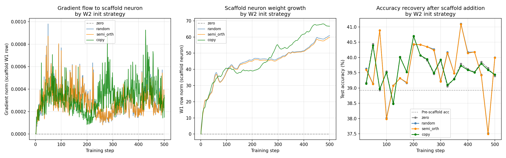

# Test P -- Scaffold Neuron Initialisation Comparison

## Setup
- Base model: IsotropicMLP [3072->24->10], pretrained 24 epochs
- Pretrained accuracy: 38.93%
- Tracking: 500 steps after scaffold neuron addition
- Device: CPU, batch=24

## Semi-Orthogonal Feasibility
- W2 shape: (10, 24) (num_classes x width)
- True orthogonality achievable: **False**
- Reason: width (24) > num_classes (10), so existing columns
  span all of R^10. There is no orthogonal complement. The paper's
  semi-orthogonal recommendation has a geometric constraint it does not mention:
  it only works when the network is narrow relative to the output dimension.
- Fallback: random unit vector scaled to 0.01 (same as 'random' condition)

## Results: Gradient and Learning Speed

| Condition | Mean grad_W1 | Peak grad_W1 | Final W1 norm | Final acc (500 steps) |
|---|---|---|---|---|
| zero | 0.000000 | 0.000000 | 0.000000 | 39.39% |
| random | 0.000288 | 0.000981 | 60.811035 | 40.00% |
| semi_orth | 0.000286 | 0.000872 | 59.752270 | 39.99% |
| copy | 0.000332 | 0.000927 | 66.688194 | 39.44% |

## Accuracy Recovery (every 25 steps)

| Step | zero | random | semi_orth | copy |
|---|---|---|---|---|
| 25 | 39.17% | 39.63% | 39.60% | 39.14% |
| 50 | 40.44% | 39.14% | 39.13% | 40.39% |
| 75 | 38.93% | 40.89% | 40.89% | 38.97% |
| 100 | 39.54% | 38.02% | 37.98% | 39.51% |
| 125 | 38.50% | 39.08% | 39.07% | 38.48% |
| 150 | 40.02% | 39.32% | 39.32% | 40.01% |
| 175 | 39.52% | 39.16% | 39.18% | 39.52% |
| 200 | 40.69% | 40.42% | 40.43% | 40.70% |
| 225 | 40.07% | 40.42% | 40.42% | 40.07% |
| 250 | 39.90% | 40.35% | 40.35% | 39.94% |
| 275 | 39.46% | 40.27% | 40.24% | 39.49% |
| 300 | 39.90% | 39.23% | 39.21% | 39.93% |
| 325 | 39.05% | 40.17% | 40.14% | 39.10% |
| 350 | 39.31% | 39.48% | 39.48% | 39.29% |
| 375 | 39.79% | 41.10% | 41.09% | 39.73% |
| 400 | 39.62% | 40.17% | 40.14% | 39.59% |
| 425 | 39.52% | 40.18% | 40.18% | 39.51% |
| 450 | 39.85% | 39.43% | 39.42% | 39.80% |
| 475 | 39.65% | 37.52% | 37.49% | 39.59% |
| 500 | 39.39% | 40.00% | 39.99% | 39.44% |

## Key Findings

1. **Zero W2**: mean gradient = 0.000000 (floor, as expected)

2. **Random W2**: mean gradient = 0.000288
   Gradient flows immediately. This is the practical recommendation from Test K.

3. **Semi-orthogonal W2**: mean gradient = 0.000286
   NOTE: True orthogonality was NOT achievable (W2 is (10, 24)). Result is identical to random.

4. **Copy existing W2**: mean gradient = 0.000332
   Reuses a learned direction at small scale.

## Practical Recommendation
Based on these results:
- Use w2_init='random' (scale 0.01) for scaffold neurons -- simplest and effective
- Semi-orthogonal offers no advantage when width > num_classes (which is the common case)
- Zero W2 prevents learning entirely (only useful when exact function preservation is required)

