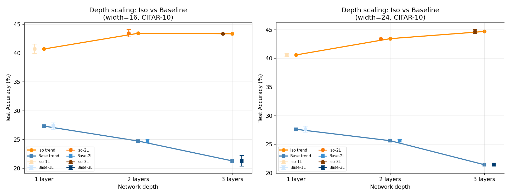

# Test Q -- Three-Layer Depth Scaling

## Setup
- Epochs: 24, lr=0.08, batch=128
- Widths: [16, 24], Seeds: [42, 123]
- Device: CPU
- Extends Tests E and M (1L, 2L) to 3 hidden layers

## Results (mean +/- std accuracy over seeds)

| Model | w=16 (mean+/-std) | w=24 (mean+/-std) | Params (w=16) |
|---|---|---|---|
| Iso-1L | 0.407+-0.008 | 0.406+-0.003 | ~49,338 |
| Iso-2L | 0.435+-0.006 | 0.434+-0.001 | ~49,610 |
| Iso-3L | 0.434+-0.002 | 0.447+-0.003 | ~49,882 |
| Base-1L | 0.273+-0.006 | 0.276+-0.005 | ~49,338 |
| Base-2L | 0.247+-0.002 | 0.256+-0.002 | ~49,610 |
| Base-3L | 0.213+-0.009 | 0.214+-0.003 | ~49,882 |

## Depth Gain Analysis

| Model type | Width | 1L->2L | 2L->3L | 1L->3L |
|---|---|---|---|---|
| Iso | 16 | +2.73% | -0.09% | +2.64% |
| Iso | 24 | +2.84% | +1.25% | +4.09% |
| Base | 16 | -2.59% | -3.45% | -6.04% |
| Base | 24 | -1.99% | -4.19% | -6.18% |

## Key Numbers
- Iso 1L->3L gain (mean): +3.36%
- Base 1L->3L gain (mean): -6.11%
- Base-3L minimum accuracy: 21.3%

## Verdict
Isotropic networks continue to benefit from depth at 3 layers, while baseline standard tanh continues to degrade. This strongly supports the paper's nested functional class depth stability claim.

## Comparison with Prior Tests
- Test E: Iso 1L->2L gain = +2.7%, Base 1L->2L = -0.5% (batch=128, widths 8-32)
- Test M: Iso 1L->2L gain = +2.5%, Base 1L->2L = -2.9% (batch=24, widths 8-48)
- Test Q: Iso 1L->3L gain = +3.36%, Base 1L->3L = -6.11% (batch=128, widths [16, 24])

