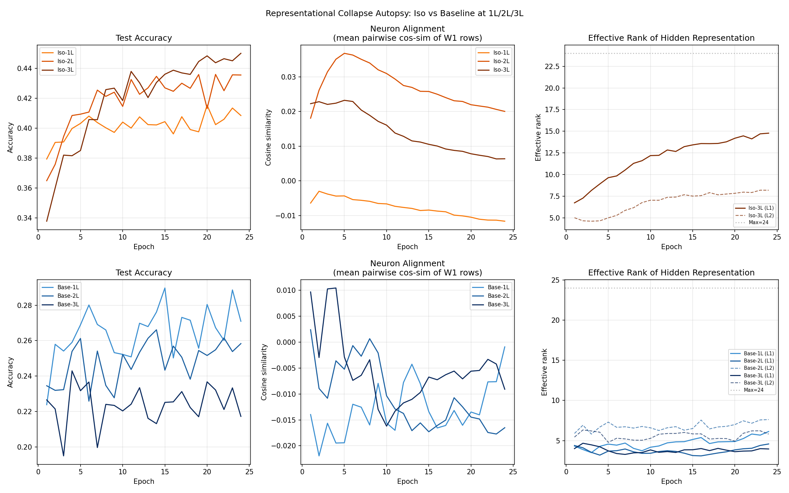

# Test R -- Representational Collapse Autopsy

## Setup
- Width: 24, Epochs: 24, lr=0.08, batch=128, seed=42
- Device: CPU
- Eval representations on 512 fixed samples per epoch

## Question
Why does Base-2L/3L accuracy collapse while Iso-2L/3L keeps improving?
Hypothesis A: Gradient vanishing (signal shrinks through layers)
Hypothesis B: Representational collapse (neurons align, rank drops)

## Final-Epoch Summary

| Model | Final Acc | Neuron Sim (W1) | Min Eff Rank |
|---|---|---|---|
| Iso-1L | 40.85% | -0.0116 | nan |
| Iso-2L | 43.56% | 0.0200 | nan |
| Iso-3L | 45.01% | 0.0064 | 4.08 |
| Base-1L | 27.09% | -0.0009 | 3.51 |
| Base-2L | 25.83% | -0.0165 | 3.10 |
| Base-3L | 21.72% | -0.0091 | 3.28 |

## Gradient Norms (per layer, final epoch)

**Iso-1L**: W1: final=0.010158, min=0.009752 | W2: final=0.076912, min=0.076450
**Iso-2L**: W1: final=0.009855, min=0.009543 | W2: final=0.020181, min=0.020181 | W3: final=0.078310, min=0.077240
**Iso-3L**: 0: final=0.009030, min=0.008284 | 2: final=0.018854, min=0.018854 | 4: final=0.024552, min=0.018028 | 6: final=0.080427, min=0.078586
**Base-1L**: 0: final=0.028633, min=0.028633 | 2: final=0.468626, min=0.464831
**Base-2L**: 0: final=0.036955, min=0.036955 | 2: final=0.042027, min=0.039911 | 4: final=0.472121, min=0.465104
**Base-3L**: 0: final=0.075837, min=0.064383 | 2: final=0.085820, min=0.082329 | 4: final=0.032418, min=0.031884 | 6: final=0.475314, min=0.466755

## Effective Rank (per hidden layer, final epoch)

**Iso-1L**: N/A
**Iso-2L**: N/A
**Iso-3L**: net: final=14.78, min=6.73 | net: final=8.19, min=4.61 | net: final=4.32, min=4.08
**Base-1L**: net: final=6.14, min=3.51
**Base-2L**: net: final=4.59, min=3.10 | net: final=7.62, min=5.82
**Base-3L**: net: final=3.96, min=3.28 | net: final=5.81, min=4.79 | net: final=6.47, min=4.75

## Verdict

Results inconclusive or suggest gradient vanishing — check gradient norm trajectories.

- Iso-3L neuron similarity (final): 0.0064
- Base-3L neuron similarity (final): -0.0091
- Iso-3L min effective rank: 4.08 / 24
- Base-3L min effective rank: 3.28 / 24

