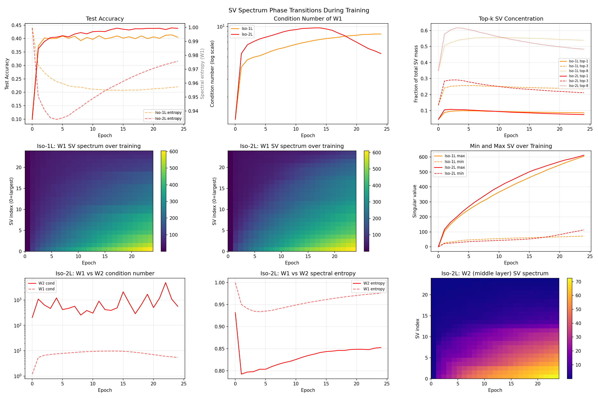

# Test S -- SV Spectrum Phase Transitions During Training

## Setup
- Width: 24, Epochs: 24, lr=0.08, batch=128, seed=42
- Device: CPU

## Iso-1L: W1 SV Metrics at Key Epochs

| Epoch | Acc | Cond | Entropy | Top-3 frac | Min SV | Max SV |
|---|---|---|---|---|---|---|
| 0 | 0.106 | 1.2 | 0.9997 | 0.134 | 0.53 | 0.63 |
| 1 | 0.372 | 4.0 | 0.9728 | 0.241 | 26.28 | 104.13 |
| 2 | 0.402 | 4.7 | 0.9676 | 0.252 | 32.10 | 150.16 |
| 4 | 0.400 | 5.1 | 0.9612 | 0.257 | 42.94 | 219.84 |
| 8 | 0.392 | 6.2 | 0.9571 | 0.252 | 51.78 | 318.77 |
| 12 | 0.399 | 7.1 | 0.9551 | 0.248 | 57.43 | 406.04 |
| 16 | 0.406 | 7.7 | 0.9550 | 0.243 | 62.32 | 480.12 |
| 20 | 0.406 | 8.2 | 0.9560 | 0.239 | 66.79 | 546.35 |
| 24 | 0.405 | 8.4 | 0.9574 | 0.235 | 71.80 | 604.79 |

## Iso-2L: W1 SV Metrics at Key Epochs

| Epoch | Acc | Cond | Entropy | Top-3 frac | Min SV | Max SV |
|---|---|---|---|---|---|---|
| 0 | 0.099 | 1.2 | 0.9997 | 0.134 | 0.53 | 0.63 |
| 1 | 0.362 | 5.4 | 0.9502 | 0.285 | 21.60 | 116.27 |
| 2 | 0.389 | 6.6 | 0.9408 | 0.291 | 24.86 | 163.91 |
| 4 | 0.405 | 7.5 | 0.9340 | 0.287 | 31.36 | 235.77 |
| 8 | 0.422 | 8.9 | 0.9428 | 0.260 | 39.61 | 352.07 |
| 12 | 0.426 | 9.6 | 0.9546 | 0.242 | 46.08 | 443.09 |
| 16 | 0.432 | 9.2 | 0.9634 | 0.230 | 56.35 | 516.10 |
| 20 | 0.438 | 7.0 | 0.9706 | 0.220 | 81.42 | 568.93 |
| 24 | 0.438 | 5.4 | 0.9757 | 0.212 | 113.36 | 611.30 |

## Key Findings

### Iso-1L
- Init condition number: 1.2
- Final condition number: 8.4
- Init spectral entropy: 0.9997
- Final spectral entropy: 0.9574
- Top-3 SVs at end: 23.5% of total mass

### Iso-2L (W1)
- Init condition number: 1.2
- Final condition number: 5.4
- Final spectral entropy: 0.9757

### Implications for Pruning
A high condition number means a large spread in SVs — many neurons with small SVs
are prunable with low error. The epoch at which this spread emerges is the earliest
point at which principled pruning can work effectively. This informs Test V's
prune-timing experiment.

