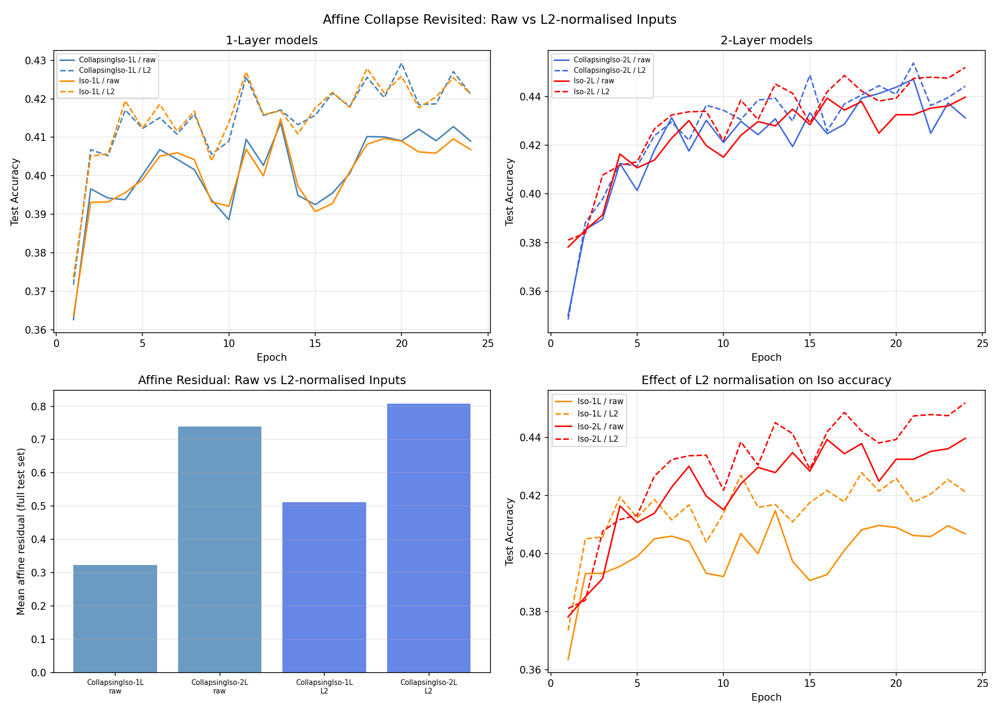

# Test T -- Affine Collapse Revisited

## Background
Test F reported residual = 0.000000 for CollapsingIsotropicMLP, but this
was a measurement artifact: 128 samples, 3073 parameters -> underdetermined
least-squares, always gives residual = 0.

Test O corrected this by using all 10K test samples:
- CollapsingIso-1L residual: 0.322367 (NOT near zero)
- CollapsingIso-2L residual: 0.739638 (NOT near zero)

This test investigates: does unit-normalising inputs (x/||x||) make the collapse exact?

## Setup
- Width: 32, Epochs: 24, lr=0.08, batch=128, seed=42
- Affine verification: FULL test set (10000 samples)
- Input conditions: raw CIFAR-10 vs L2-normalised (x/||x||)

## Results

| Config | Final Acc | Affine Residual |
|---|---|---|
| CollapsingIso-1L / raw | 40.90% | mean=0.322367, rel=0.2451 |
| CollapsingIso-2L / raw | 43.12% | mean=0.739638, rel=0.4156 |
| CollapsingIso-1L / L2 | 42.12% | mean=0.511899, rel=0.3075 |
| CollapsingIso-2L / L2 | 44.42% | mean=0.808384, rel=0.4423 |
| Iso-1L / raw | 40.68% | N/A (not collapsing) |
| Iso-2L / raw | 43.97% | N/A (not collapsing) |
| Iso-1L / L2 | 42.13% | N/A (not collapsing) |
| Iso-2L / L2 | 45.19% | N/A (not collapsing) |

## Affine Residuals (Corrected, Full Test Set)

| Model | Raw inputs | L2-normalised inputs |
|---|---|---|
| CollapsingIso-1L | mean=0.322367, rel=0.2451 | mean=0.511899, rel=0.3075 |
| CollapsingIso-2L | mean=0.739638, rel=0.4156 | mean=0.808384, rel=0.4423 |

## Verdict
Even unit-sphere inputs yield significant residual. The affine collapse is weaker than Appendix C claims, even in the theorem's intended domain.

## What Test F Got Wrong
Test F used batch_size=128 to fit an affine model with input_dim=3072+1=
parameters. Since 128 << 3072+1, the least-squares system was underdetermined
and always returned residual=0, regardless of whether the model is affine.
The correct measurement requires N >> input_dim (satisfied here with N=10,000).

