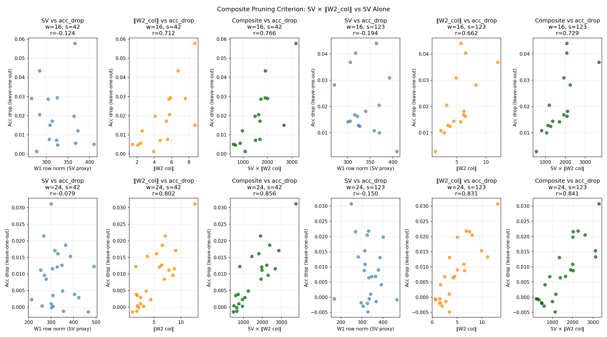
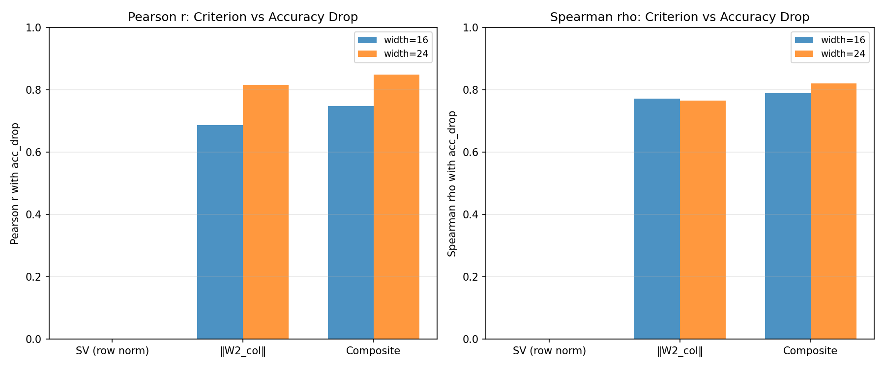

# Test U -- Composite Pruning Criterion

## Setup
- Model: IsotropicMLP [3072->width->10]
- Epochs: 24, lr=0.08, batch=128
- Widths: [16, 24], Seeds: [42, 123]
- Device: CPU
- Pruning method: leave-one-out (zero out W1 row, W2 col, b1 entry)
- Criteria compared: SV (W1 row norm), ‖W2_col‖, Composite = SV × ‖W2_col‖

## Question
Does SV × ‖W2_col‖ predict pruning impact better than SV alone?
Test G found r(SV, acc_drop) = 0.77 for a different protocol.

## Results

| Width | Seed | r(SV) | r(W2_col) | r(Composite) | rho(SV) | rho(W2_col) | rho(Composite) |
|---|---|---|---|---|---|---|---|
| 16 | 42 | -0.1242 | 0.7122 | 0.7659 | -0.2353 | 0.7971 | 0.8029 |
| 16 | 123 | -0.1945 | 0.6621 | 0.7293 | -0.2382 | 0.7471 | 0.7765 |
| 24 | 42 | -0.0793 | 0.8025 | 0.8560 | -0.0070 | 0.6922 | 0.7930 |
| 24 | 123 | -0.1495 | 0.8305 | 0.8408 | -0.1322 | 0.8380 | 0.8476 |
| **16 (mean)** | — | **-0.1593** | **0.6871** | **0.7476** | **-0.2368** | **0.7721** | **0.7897** |
| **24 (mean)** | — | **-0.1144** | **0.8165** | **0.8484** | **-0.0696** | **0.7651** | **0.8203** |

## Key Correlations (mean over widths × seeds)
- r(SV, acc_drop) = -0.1369
- r(‖W2_col‖, acc_drop) = 0.7518
- r(Composite, acc_drop) = 0.7980
- Composite improvement over SV: +0.9349

## Verdict
Composite criterion SV × ‖W2_col‖ outperforms SV alone by +0.9349 Pearson r. The W2 column norm carries additional information about neuron importance beyond the input representation breadth.

## Comparison with Test G
Test G used SV from full W1 SVD decomposition on a different protocol.
This test uses W1 row norms as the per-neuron SV proxy (directly
interpretable as the "magnitude" of each neuron's input filter).

