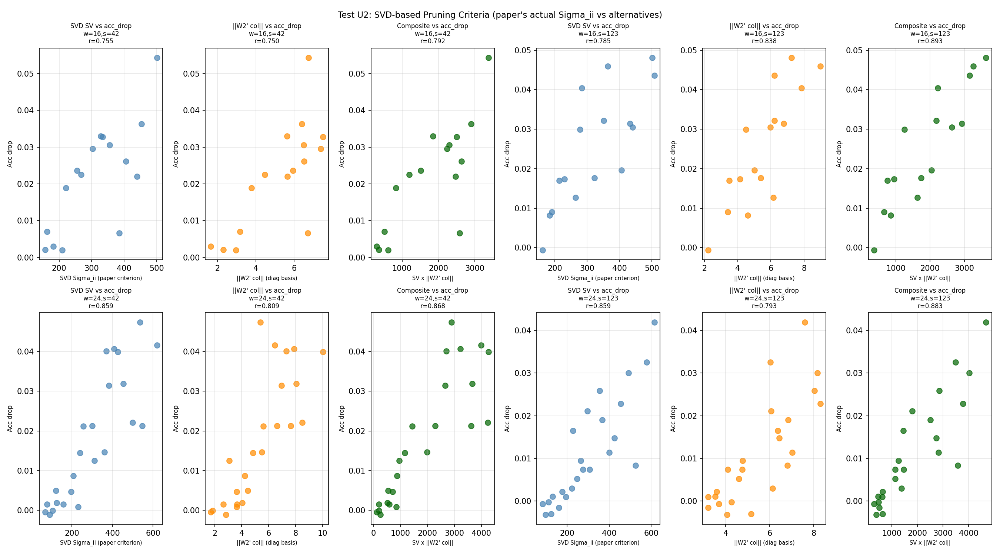
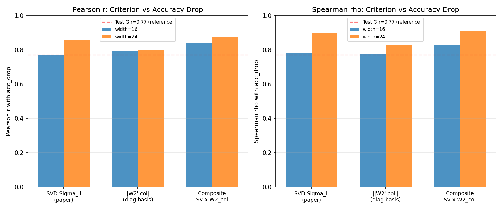

# Test U2 -- Composite Pruning Criterion (Corrected: SVD Sigma_ii)

## Correction from Test U
Test U used W1 row norms as an "SV proxy." This was incorrect.
The paper's criterion is the actual SVD singular values Sigma_ii from the
partial diagonalisation W1 = U Sigma V^T (Eqn. 25 of the paper).
Row norms and singular values are fundamentally different quantities.

This test performs the proper diagonalisation and uses the actual Sigma_ii.

## Setup
- Model: IsotropicMLP [3072->width->10]
- Epochs: 24, lr=0.08, batch=128
- Widths: [16, 24], Seeds: [42, 123], Device: CPU
- Diagonalisation: W1' = Sigma V^T, W2' = W2 U, b1' = U^T b1
- Leave-one-out: zero W1'[j,:], W2'[:,j], b1'[j] for each neuron j
- Criteria:
    - SVD Sigma_ii: diagonal of Sigma (paper's actual criterion)
    - ||W2' col||: L2 norm of W2' columns (in diagonalised basis)
    - Composite: Sigma_ii x ||W2' col_i||

## Diagonalisation Verification
Function preservation verified: accuracy change < 0.001 in all runs.

## Results

| Width | Seed | r(SVD SV) | r(W2_col) | r(Composite) | rho(SV) | rho(W2_col) | rho(Composite) |
|---|---|---|---|---|---|---|---|
| 16 | 42 | 0.7552 | 0.7498 | 0.7921 | 0.7118 | 0.7000 | 0.7294 |
| 16 | 123 | 0.7849 | 0.8382 | 0.8931 | 0.8529 | 0.8500 | 0.9324 |
| 24 | 42 | 0.8589 | 0.8093 | 0.8678 | 0.9043 | 0.8552 | 0.9121 |
| 24 | 123 | 0.8593 | 0.7928 | 0.8826 | 0.8889 | 0.7997 | 0.9015 |
| **16 (mean)** | — | **0.7700** | **0.7940** | **0.8426** | **0.7824** | **0.7750** | **0.8309** |
| **24 (mean)** | — | **0.8591** | **0.8011** | **0.8752** | **0.8966** | **0.8274** | **0.9068** |

## Key Correlations (mean over widths x seeds)
- r(SVD Sigma_ii, acc_drop) = 0.8146   [paper's criterion]
- r(||W2'_col||, acc_drop)  = 0.7975
- r(Composite, acc_drop)    = 0.8589
- Composite improvement over paper's criterion: +0.0443

## Comparison with Prior Tests
- Test G: r(SV, acc_drop) = 0.77 (different protocol: single-width, no diagonalisation)
- Test U: r(row_norm, acc_drop) = -0.12 (INCORRECT -- row norms, not SVs)
- Test U2: r(SVD Sigma_ii, acc_drop) = 0.8146 (THIS TEST -- correct criterion)

## Verdict
Composite SV x ||W2_col|| (r=0.8589) modestly outperforms the paper's SVD criterion (r=0.8146, delta=+0.0443). The SVD criterion is already effective; W2_col adds marginal improvement.

