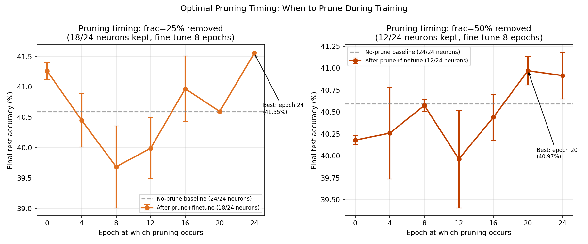
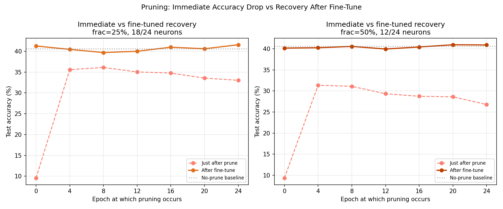

# Test V -- Optimal Pruning Timing

## Setup
- Model: IsotropicMLP [3072->24->10]
- Total training: 24 epochs, lr=0.08, batch=128
- Pruning fraction: [0.25, 0.5] of 24 neurons
- Fine-tune after pruning: 8 epochs
- Prune epochs tested: [0, 4, 8, 12, 16, 20, 24]
- Seeds: [42, 123], Device: CPU
- Criterion: W1 row norm (SV proxy), remove bottom-k

## No-Pruning Baseline
Full 24-neuron model, 24 epochs: **40.59%** (mean over seeds)

## Results: 25% Pruning (remove 6, keep 18/24)

| Prune epoch | n_kept | Immed. acc (mean) | Final acc (mean±std) | vs baseline |
|---|---|---|---|---|
| 0 | 18/24 | 9.59% | 41.26%±0.14% | +0.66% |
| 4 | 18/24 | 35.59% | 40.45%±0.44% | -0.15% |
| 8 | 18/24 | 36.10% | 39.69%±0.68% | -0.91% |
| 12 | 18/24 | 35.03% | 39.99%±0.50% | -0.60% |
| 16 | 18/24 | 34.76% | 40.97%±0.54% | +0.38% |
| 20 | 18/24 | 33.55% | 40.60%±0.02% | +0.00% |
| 24 | 18/24 | 33.02% | 41.55%±0.02% | +0.96% |

## Results: 50% Pruning (remove 12, keep 12/24)

| Prune epoch | n_kept | Immed. acc (mean) | Final acc (mean±std) | vs baseline |
|---|---|---|---|---|
| 0 | 12/24 | 9.35% | 40.18%±0.05% | -0.41% |
| 4 | 12/24 | 31.37% | 40.26%±0.52% | -0.34% |
| 8 | 12/24 | 31.10% | 40.58%±0.06% | -0.02% |
| 12 | 12/24 | 29.35% | 39.97%±0.55% | -0.63% |
| 16 | 12/24 | 28.74% | 40.44%±0.26% | -0.15% |
| 20 | 12/24 | 28.62% | 40.97%±0.16% | +0.38% |
| 24 | 12/24 | 26.79% | 40.91%±0.27% | +0.32% |

## Best Configurations
- frac=25%: best at epoch 24, acc=41.55%
- frac=50%: best at epoch 20, acc=40.97%

## Verdict
Late pruning (epoch 24) is optimal — the spectrum needs time to settle before the SV-based criterion is reliable.

## Relationship to Test S
Test S tracks the SV spectrum evolution and spectral entropy at every epoch.
The optimal pruning epoch from this test can be compared against the
spectral entropy trajectory from Test S to verify whether entropy-based
timing matches empirical accuracy.

