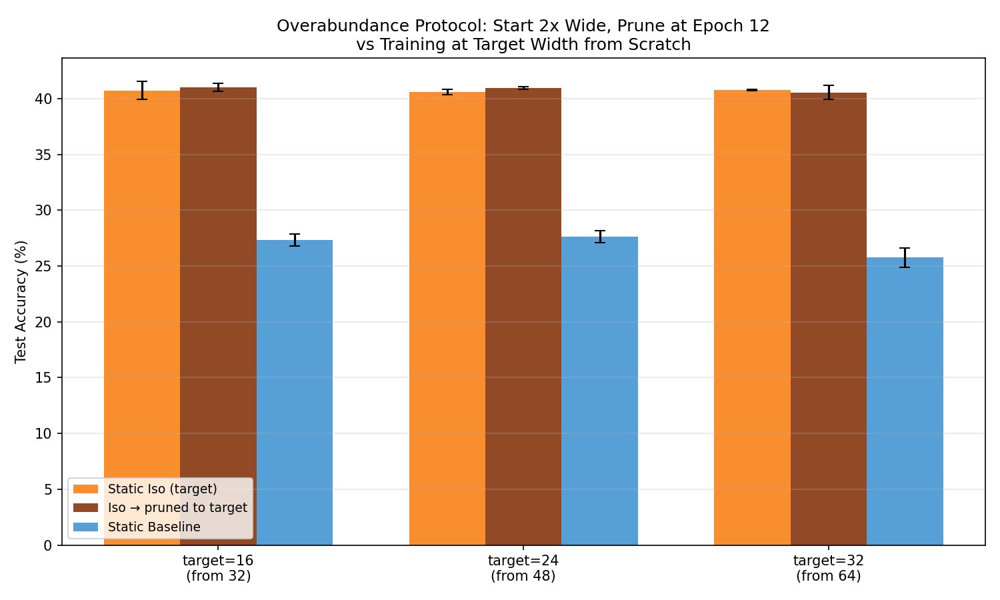

# Test W -- Overabundance Protocol

## Setup
- Total epochs: 24, prune at epoch 12
- Start width: 2x target, prune to target using SVD SV criterion
- Widths: targets=[16, 24, 32], seeds=[42, 123], lr=0.08, batch=128
- Device: CPU

## Question
Does starting 2x wide and pruning halfway through beat training at the
target width from scratch? This tests the paper's biological overabundance claim.

## Results

| Target width | Over width | Static Iso | Overabundant->Pruned | Gain | Static Baseline |
|---|---|---|---|---|---|
| 16 | 32 | 40.73% | 41.01% | +0.28% | 27.32% |
| 24 | 48 | 40.59% | 40.95% | +0.35% | 27.62% |
| 32 | 64 | 40.76% | 40.55% | -0.21% | 25.74% |

## Per-width gains (Overabundant - Static Iso)
- target=16: +0.28%
- target=24: +0.35%
- target=32: -0.21%
- Mean gain: +0.14%

## Verdict
Overabundance shows marginal gain (+0.14%). The effect is present but small — the protocol works but the advantage over direct training is modest at these scales.

## Paper's Claim
Section 4: "the 32 width layer begins at a higher accuracy, and maintains this
for 16 and 24 width networks, suggesting an initial overabundance of neurons,
followed by neurodegeneration, is beneficial for performance."

