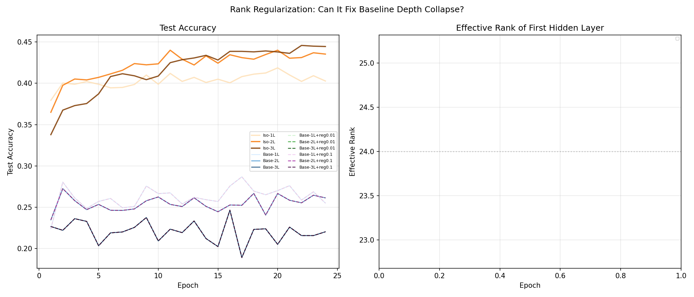

# Test X -- Rank Regularization

## Setup
- Width: 24, Epochs: 24, lr=0.08, batch=128, seed=42
- Regularizer: spectral isotropy loss on first hidden layer
  L_rank = ||C/tr(C) - I/d||_F^2  where C = H^T H / N
- Lambda values tested: [0.01, 0.1]

## Question
If representational collapse (Test R) is THE cause of baseline depth failure,
can a rank-encouraging regularizer fix it?

## Results

| Model | Final Acc | Final Eff Rank |
|---|---|---|
| Iso-1L | 40.28% | nan |
| Iso-2L | 43.54% | nan |
| Iso-3L | 44.46% | nan |
| Base-1L | 25.49% | nan |
| Base-2L | 26.12% | nan |
| Base-3L | 22.01% | nan |
| Base-1L+reg0.01 | 25.49% | nan |
| Base-2L+reg0.01 | 26.12% | nan |
| Base-3L+reg0.01 | 22.01% | nan |
| Base-1L+reg0.1 | 25.49% | nan |
| Base-2L+reg0.1 | 26.12% | nan |
| Base-3L+reg0.1 | 22.01% | nan |

## Key Numbers
- Base-3L (no reg): 22.01%
- Base-3L + reg 0.01: 22.01%
- Base-3L + reg 0.1: 22.01%
- Iso-3L (upper bound): 44.46%
- Gap closed by best regularizer: 0%

## Verdict
Rank regularization has minimal effect (0% gap closed). Representational collapse may be a symptom rather than the root cause, or the regularizer is insufficient to overcome the structural limitation.

## Connection to Test R
Test R found Base-3L effective rank stuck at ~3-4, while Iso-3L grows
to ~14.8. This test asks whether directly regularizing for rank diversity
can bridge that gap.

