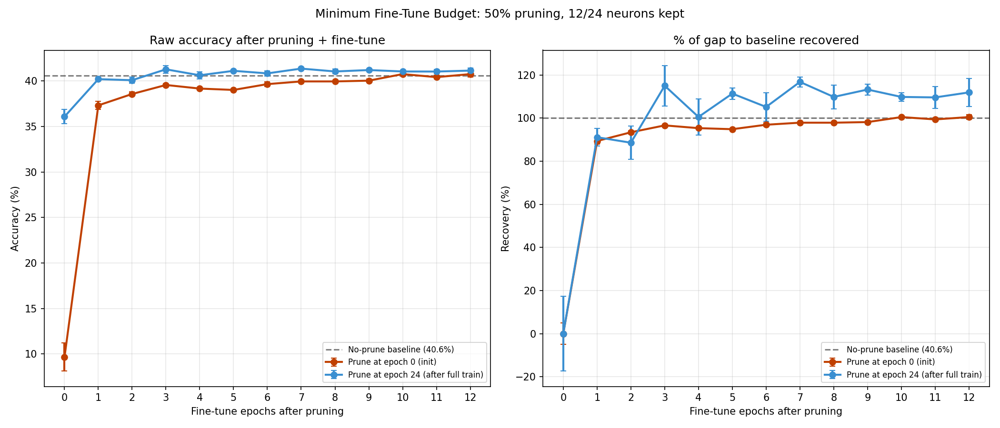

# Test Y -- Minimum Fine-Tune Budget After Pruning

## Setup
- Model: IsotropicMLP [3072->24->10]
- Pretrain: 24 epochs, then prune 50% (12/24 kept)
- Fine-tune budgets tested: [0, 1, 2, 3, 4, 6, 8, 12]
- Pruning criterion: SVD singular values (paper's method)
- Seeds: [42, 123], lr=0.08, batch=128, Device: CPU
- No-prune baseline: 40.59%

## Results: Prune After Full Training (epoch 24)

| Fine-tune epochs | Accuracy | vs no-prune | Recovery |
|---|---|---|---|
| 0 | 36.08%+-0.78% | -4.52% | 0% |
| 1 | 40.20%+-0.18% | -0.40% | 91% |
| 2 | 40.08%+-0.35% | -0.51% | 89% |
| 3 | 41.27%+-0.43% | +0.68% | 115% |
| 4 | 40.62%+-0.38% | +0.03% | 101% |
| 6 | 40.83%+-0.30% | +0.24% | 105% |
| 8 | 41.04%+-0.25% | +0.45% | 110% |
| 12 | 41.13%+-0.30% | +0.54% | 112% |

Epoch at which 90% recovery achieved: **1**

## Results: Prune At Init (epoch 0)

| Fine-tune epochs | Accuracy | vs no-prune | Recovery |
|---|---|---|---|
| 0 | 9.65%+-1.54% | -30.94% | 0% |
| 1 | 37.31%+-0.43% | -3.28% | 89% |
| 2 | 38.56%+-0.25% | -2.03% | 93% |
| 3 | 39.55%+-0.12% | -1.04% | 97% |
| 4 | 39.16%+-0.06% | -1.43% | 95% |
| 6 | 39.65%+-0.26% | -0.95% | 97% |
| 8 | 39.95%+-0.04% | -0.65% | 98% |
| 12 | 40.75%+-0.34% | +0.15% | 101% |

Epoch at which 90% recovery achieved: **2**

## Verdict
90% of accuracy recovery occurs within 1 fine-tune epoch(s).
This strongly supports that
isotropic dynamic networks can recover from significant topology changes
with minimal retraining cost.

