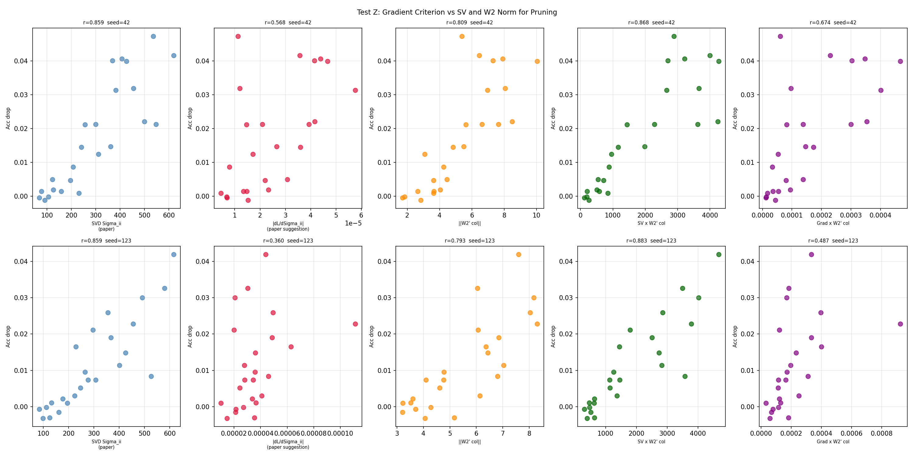

# Test Z -- Gradient-Based Pruning Criterion

## Setup
- Model: IsotropicMLP [3072->24->10], trained 24 epochs
- Diagonalised before evaluation (W1 = U Sigma V^T)
- Gradient averaged over 4 training batches
- Leave-one-out pruning in diagonalised basis
- Seeds: [42, 123], lr=0.08, batch=128, Device: CPU

## Question
Does |dL/dSigma_ii| (paper's footnote 5 suggestion) predict pruning
impact better than SV alone or W2_col?

## Results

| Criterion | Pearson r | Spearman rho |
|---|---|---|
| SV (Sigma_ii) | 0.8591 | 0.8966 |
| |dL/dSigma| | 0.4641 | 0.5023 |
| ||W2_col|| | 0.8011 | 0.8274 |
| SV x W2 | 0.8752 | 0.9068 |
| Grad x W2 | 0.5806 | 0.7233 |

## Verdict
The gradient criterion (r=0.4641) does not outperform SV alone (r=0.8591). Best overall: SV x W2 (r=0.8752).

## Paper Reference
Footnote 5, page 7: "one may combine approaches and consider the gradient
with respect to the diagonalised singular value as a threshold for pruning
-- this is also effectively a batch statistic."

